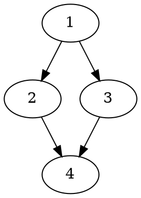
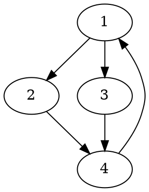
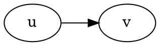

2020 Week 11: Graph
=
本主題會用到[第五週](https://hackmd.io/@nckuacm/BJ6l2P2UL)及[第七週](https://hackmd.io/@nckuacm/S1Adidxu8)教材的內容
> 不熟的話，底下介紹的都看不懂了

圖論最為重要觀念就是 **"連通"**，
若說此圖為連通圖，則所有點能透過邊接到任一點 (**弱連通**)[^1]。
而不只接上還能**走過去**(有向邊)[^directed_edge]，則為**強連通**。

例如：

上圖弱連通但非強連通。

若是這樣：

則上圖為強連通。


# 點與邊的表示方式
==以下兩個結構體，將成為本篇的慣例==

- 點
```cpp
struct node {
  int id, w; // id := 點編號, w := 連結到此點的權重 (邊權重)
  bool operator<(const node &rhs) const {
    return w > rhs.w; // 使 priority_queue 為 min heap
  }
};
```

- 邊
```cpp
struct edge {
  int u, v, w; // u := 起端編號, v := 終端編號, w := 權重
  bool operator<(const edge &rhs) const {
    return w > rhs.w; // 使 priority_queue 為 min heap
  }
};
```
討論圖的邊，常會有 $u$ 是邊起點與 $v$ 是邊終點的慣例用符


# Minimum spanning tree (MST)
最小生成樹 (Minimum spanning tree) 簡稱 MST。

給定圖 $G=(E, V)$，使用 $E$ 子集連結所有點 (來自 $V$) 所得到的樹為**生成樹**。
> $E$ 為邊集合，$V$ 為點集合

若帶權重圖的某生成樹為所有生成樹中**權重總和最小**，則稱此為**最小生成樹**
 [^min_span_tree]

:::info
給定一個連通圖，找出一個最小生成樹
:::

## Kruskal 演算法
Kruskal 用了兩個重要的觀念：
- 樹是**無環**的**連通**圖
- 若圖中只有點沒有任何邊，那麼每個點都是一個獨立的**連通塊**。
>這有什麼可利用的呢？

若將一點連向另一點，整張圖就少了一個連通塊，
反覆操作，最終圖上只會有一個連通塊，若最終連通塊**沒有環**，那他就是樹，他就是此圖的**生成樹**。

於是在連通塊與連通塊相連這個動作，確保產生的連通塊無環就行：
連通塊 $A$ 想與連通塊 $B$ 相連，只要 $A \not= B$，那麼相連的新連通塊**保證無環**。

>怎樣產生出**最小**生成樹？

所以若在 $A$ 與 $B$ 相連時**每次**考慮**最小權重的邊**，那最終產生的一定是最小權重的生成樹
>沒錯哦，這是最優子結構

 [^kruskaldemo]

實作上先將每個邊依照權重排序，
```cpp
vector<edge> E;
  :
  .
sort(E.begin(), E.end(), [&](edge x, edge y) { return x.w < y.w; });
```
接著用 DFS 判斷塊與塊是否為同個連通塊，若不是的話就能相連起來。
DFS 每次都將連通塊的邊遍歷，複雜度為 $O(|E|^2)$

還記得 [Union-Find Forest](https://hackmd.io/@nckuacm/BJ6l2P2UL#Union-Find-Forest-%E4%BD%B5%E6%9F%A5%E6%A3%AE%E6%9E%97) 嗎？**分類問題**包括連通塊的分類也能使用它：
```cpp
for (edge e: E) {
  int a = Find(e.u), b = Find(e.v);
  if (a != b) {
    Union(e.u, e.v);
    cost += e.w;
    MST.push_back({u, v, w});
  }
}
```
複雜度約為 $O(|E|\log |E|+|E|\cdot \alpha)$
其中 $\alpha = \alpha(|E|)$ 為 Union-Find Forest 的時間成本 (通常很小)

#### 範例 [UVa OJ 10369 Arctic Network](https://uva.onlinejudge.org/external/103/10369.pdf)：
:::spoiler
很直覺的，使 outpost 都能通訊的簡單方法，就是做出樹
畢竟若兩點已能通訊，加入一條形成環的邊不會更好。

而想使 D 下降的方法就是將 network 上的 distance 盡量小，也就是要求最小生成樹
而生成樹上較大的邊就用 satellite channel 來解決

先把 outpost 之間的距離算出來：
```cpp
vector<edge> E;
for(int v = 0; v < P; v++) {
  scanf("%lf%lf", &C[v].x, &C[v].y);
  for(int u = 0; u < v; u++) E.push_back({u, v, dist(C[u], C[v])});
}
```

接著將最小生成樹 (network) 上最大的距離找出來：
```cpp
sort(E.begin(), E.end(), [&](edge A, edge B) { return A.dist < B.dist; });

vector<double> D;
for(edge e: E) {
  int a = Find(e.u), b = Find(e.v);
  if(a != b) {
    D.push_back(e.dist);
    Union(e.u, e.v);
  }
}

printf("%.2lf\n", D[P-S-1]);
```
:::


#### 練習：
[TIOJ 1211 圖論 之 最小生成樹 ](https://tioj.ck.tp.edu.tw/problems/1211)
[AIZU 1280 Slim Span](http://judge.u-aizu.ac.jp/onlinejudge/description.jsp?id=1280)
[NCPC 2018 Final Problem E Connecting Cities](https://e-tutor.itsa.org.tw/e-Tutor/mod/programming/view.php?id=45110)
[TIOJ 1445 機器人組裝大賽](https://tioj.ck.tp.edu.tw/problems/1445)
[TIOJ 1795 咕嚕咕嚕呱啦呱啦](https://tioj.ck.tp.edu.tw/problems/1795)

---

## Prim 演算法
Prim 維護一個**未完成的生成樹**
其精神是：每次將樹**周遭**有**最小權重**的邊接到樹上，使樹最終**成長**至最小生成樹
> 傑出的一手貪心策略

[^primdemo]


Prim 用了兩個重要的觀念：
- 樹是**無環**的**連通**圖
- 若圖中只有點沒有任何邊，那麼每個點都是一個獨立的**連通塊**。
> 跟 Kruskal 一樣呢

首先隨便找任意點，作為那個初始的"未完成的生成樹"，也就是一塊無環的連通圖 $A$
**每次**將 $A$ 能觸及到的**最小權重**的邊接上 $A$，那最終產生的一定是最小權重的生成樹

>跟 Kruskal 不同的是，這裡枚舉的是"*點*"
```cpp
vector<node> E[maxn]; // maxn 為最大節點數
  :
  .
priority_queue<edge> Q; // 每次挑最小權重的邊
Q.push({1, 1, 0}); // 初始的生成樹 (只有一個點)

while (!Q.empty()) {
  edge e = Q.top(); Q.pop();
  int u = e.v;

  if (vis[u]) continue; // 避免出現環
  vis[u] = true;
  
  cost += e.w;
  MST.push_back(e);
  for (node v: E[u]) if(!vis[v.id]) Q.push({u, v.id, v.w});
}
```
複雜度約 $O(|E|\log_2 |V|)$

#### 練習：
[UVa OJ 908 Re-connecting Computer Sites](https://uva.onlinejudge.org/external/9/908.pdf)
[ACM-ICPC 2005 Southwestern 3505 Buy or Build](https://icpcarchive.ecs.baylor.edu/external/35/3505.pdf)

# A* 搜尋法則
是路徑搜尋演算法的一個抽象觀點

A* 在節點 $n$ 有個評估函數 $f(n) = g(n) + h(n)$
當 $f(n)$ 大於**門檻**時就剪枝
$g(n)$ 表示從起點到節點 $n$ 的成本
$h(n)$ 表示從節點 $n$ 到終點的成本

>評估函數是根據欲求解問題而設計，討論上是相當自由的

例如：
- 當 $g(n)$ 是搜尋深度(或最短路步數)， 即 Breadth-first Search 是 A* 的特例
- 有種搜尋法叫做 Best-first Search， $h(n)$ 為該節點 $n$ 到終點的歐幾里得距離

## Iterative Deepening A* (IDA*)
IDA* 是種 A* 的變形，會逐步地將門檻變寬

假設門檻是遞迴深度 (`maxd`)，那麼就逐漸放寬標準：
```cpp
for(int maxd = 0;; maxd++) if(dfs(0, maxd)) break; // 搜到就結束(break)
```
進行搜尋時一旦超過門檻就結束搜尋：
```cpp
bool dfs(int d, int maxd) {
  if(d >= maxd) return false;
    :
    .
}
```

#### 範例 [AIZU 1271 Power Calculus](http://judge.u-aizu.ac.jp/onlinejudge/description.jsp?id=1271)：
:::spoiler
直覺的，將**所有**羃次 (`p`) 的組合全部都**試試看**，找出**最小**的操作數 (operations) 就行：

```cpp
int ans = n; // 操作數至多為 n

void dfs(int d) {
  if (p[d] == n) ans = min(ans, d);
  if (d == n-1) return;

  for (int i = 0; i <= d; i++) {
    p[d+1] = p[d] + p[i];
    dfs(d+1);
    p[d+1] = p[d] - p[i];
    dfs(d+1);
  }
}
```
執行前先設定邊界(當還未進行操作)：
```cpp
p[0] = 1;
```
複雜度為 $O(n^n)$
> 複雜度頗高， $n=10$ 的時候就能感受到輸出遲緩了

解答也許在深度**還很小**的時候就已經能找到了，所以將深度給定一個上限 (`ops`)：
```cpp
bool dfs(int d) { // d := depth
  if(p[d] == n) return true;
  if(d == ops) return false;

  for(int i = 0; i <= d; i++) {
    p[d+1] = p[d] + p[i];
    if(dfs(d+1)) return true;
    p[d+1] = p[d] - p[i];
    if(dfs(d+1)) return true;
  }

  return false;
}
```

接著每次將深度/操作數 (`ops`) 的上限逐步提高：
```cpp
while(scanf("%d", &n) && n) {
  for(ops = log2(n);; ops++) if(dfs(0)) break;
  printf("%d\n", ops); // 印出題目要求答案
}
```

但這題還不只如此，除了 IDA* 門檻設定以外，還得額外剪枝
當剩餘的操作數**絕不可能**湊出目標羃次 (`n`) 時，就不繼續以此狀態深入搜尋：
```cpp
int mx = 0;
for(int i = 0; i <= d; i++) mx = max(mx, p[i]);
if((mx << (ops-d)) < n) return false;
```
:::

#### 練習：
[UVa OJ 11212 Editing a Book](https://uva.onlinejudge.org/external/112/11212.pdf)
[UVa OJ 12558 Egyptian Fractions (HARD version)](https://uva.onlinejudge.org/external/125/12558.pdf)
[UVa OJ 1343 The Rotation Game](https://uva.onlinejudge.org/external/13/1343.pdf)
[UVa OJ 11846 Finding Seats Again](https://uva.onlinejudge.org/external/118/11846.pdf)
\* [UVa OJ 11376 Tilt!](https://uva.onlinejudge.org/external/113/11376.pdf)


# Single-Source Shortest Paths
單源最短路徑 (Single-Source Shortest Paths) 簡稱 SSSP。
源點 (Source)，就是**起點**，通常問題都只是簡單求每條路徑的最小成本。

:::info
求單源點到其他所有節點的最短路徑總權重
:::

## Relaxation
想像自己在圖中是某一點 `v`，你看到你的鄰點們 `u`，他們告訴你：源點走到他們那裡的*最小花費成本* `cost[u]` 是多少，同時你也知道那些點們要過來你這分別要花費多少成本 `w` (i.e. 邊權重)
考慮源點到自己這的最小成本 `cost[v]` 得知：
```cpp
int update = cost[u] + w;
if (update < cost[v]) cost[v] = update;
```

## Bellman-Ford's Algorithm
狀態 $S(n)$ 代表**從源點**到 $n$ 的最小成本
對於點 $v$ 顯然若 $(u, v) \in E$，則 $S(v) \leq S(u) + \text{weight}(u,v)$
所以狀態轉移方程為 $S(v) = \min\limits_{(u, v) \in E}(S(u) + \text{weight}(u,v))$
> 這就是 relaxation
<!-- > 要注意，當 $S(u)$ 還未解出，不能將它用在更新 $S(v)$ -->

邊界(源點到源點最小成本)為 $S(\text{source}) = 0$
初始其餘的狀態設為無限大[^unknown-cost]，以表示尚未得到最佳解

若是一次將**所有邊都做  relaxation**，那麼重複做，每次至少可以將一個點解出
> 在下方 Dijkstra's algo 有給出間接證明
<!-- 
:::danger
TODO: 計算順序的證明
:::
 -->
最開始先從邊界(起點)的鄰點解出(relaxation)，接著是鄰點們的鄰點.. 直至所有的點。
所以至多只要重複做 $|V|-1$ 次，就能將所有點解出
> $-1$ 是因為起點已經先被解出了


==但假設 $(u, v) \in E. S(u)$ 是最優解，而 $S(v)$ 被 $S(u)$ 更新了，$S(v)$ 還不一定是最優解==


```cpp
vector<edge> E;
  :
  .
memset(s, 0x3f, sizeof(s)); // 源點到任意點的成本初始為無限大
s[source] = 0;

for (int i = 1; i < V.size(); i++) // 共 V.size() - 1 次
  for (edge e: E)
    s[e.v] = min(s[e.v], s[e.u] + e.w);
```

> 找單源最短路徑就是這麼簡單 :+1: 
> 與[第七週教材](https://hackmd.io/@nckuacm/S1Adidxu8#%E5%96%AE%E6%BA%90%E6%9C%80%E7%9F%AD%E8%B7%AF%E5%BE%91)比較，兩者不同在於狀態*求解的順序*

Bellman-Ford's algo 可以簡單處理權重是**負的**情況：
- 對每邊做至多 $|V|-1$ 次 relaxation 後，
- 要是某邊還能 relax，就表示有個負權重的邊能使路徑**成本一直降低**。

#### 範例 [UVa OJ 558 Wormholes](https://uva.onlinejudge.org/external/5/558.pdf)：
:::spoiler
先做 $|V|-1$ 次的每邊 relaxation
```cpp
fill(s, s+n, INF);
s[0] = 0; // source
 
for(int i = 0; i < n-1; i++)
  for(int j = 0; j < m; j++)
    s[y[j]] = min(s[y[j]], s[x[j]] + t[j]); // relaxtion
```

接著就能判斷是否能回到過去
```cpp
for(int j = 0; j < m; j++)
  if(s[x[j]] + t[j] < s[y[j]]) return true; // 還能做 relaxation

return false;
```
:::

#### 練習：
[POJ 2387 Til the Cows Come Home](http://poj.org/problem?id=2387)
[UVa OJ 10000 Longest Paths](https://uva.onlinejudge.org/external/100/10000.pdf)


## Shortest Path Fast Algorithm (SPFA)
Bellman-Ford’s algorithm 的進化版本，
其動機是： 若邊被 relax 過，則它的**鄰點**可以直接進行 relaxation

```cpp
memset(s, 0x3f, sizeof(s));
s[source] = 0;
memset(in_que, false, sizeof in_que); // in_que := is it in queue?

queue<int> Q;
Q.push(source);
in_que[source] = true;

while (!Q.empty()) {
  int u = Q.front(); Q.pop();
  in_que[u] = false;
  
  for (node v: E[u])
    if (s[v.id] > s[u] + v.w) {
      s[v.id] = s[u] + v.w; // relaxation
      if (!in_que[v.id]) Q.push(v.id), in_que[v.id] = true; // 下次直接讓 v.id 的鄰點做 relaxation
    }
}
```
> 長得很像 Dijkstra’s algo

最壞複雜度 $O(|V|\cdot |E|)$
>平均而言 $O(k \cdot |E|)$， SPFA 提出者認為 $k$ 很小:accept:
> 個人而言，下面 Dijkstra’s algo 實用期望值比較高 [name=ys]


#### 練習：
[UVa OJ 658 It’s not a Bug, it’s a Feature!](https://uva.onlinejudge.org/external/6/658.pdf)

## Dijkstra's Algorithm
Dijkstra's algo 可看作是 BFS 的帶權重版本
>BFS (Breadth-first Search) 的詳細流程請複習[第五週教材](https://hackmd.io/@nckuacm/BJ6l2P2UL#BFS)

再次從 Bellman-Ford's algorithm 出發，
但每次欲更新 $S(v)$ 需從**已解**的 $S(u)$ 做 relaxation，其中 $(u, v) \in E$

考慮 Bellman-Ford's algo 不斷更新 $S(v)$ 直至**得最優解**
每一次對所有邊都嘗試 relaxation 會有一些點被更新，姑且稱剛被更新的點為**候選點**
候選點都由已解的點 relax 過了，接下來只剩他們可以互相 relax 彼此
==但**值最小**的點不會再被 relax 了==

不被 relax 的條件是 $\forall (u, v) \in E. S(u) + \text{weight}(u,v) > S(v)$，這裡 $u, v$ 是候選點
是因 $S(u) > S(v) > 0$ 且 $\text{weight}(u,v)$ **不為負**。此刻 $S(v)$ 就是最優解
> 籠統地說，是找不到點能靠加正值去更新比自己小的點


[^dijkstrademo]


```cpp
vector<node> E[maxn]; // 邊集合

memset(s, 0x3f, sizeof(s)); // 源點到任意點的成本初始為無限大
priority_queue<node> Q; // 為從未解集挑出已解的狀態
Q.push({source, s[source] = 0});
```

接著找出源點到任意點的最短路徑，其就是 BFS 並搭配 Relaxation
> 而 queue 將保存候選點，且負責挑出**最小**的點 (已解狀態)

```cpp
while (!Q.empty()) {
  node u = Q.top(); Q.pop();
  
  for (node v: E[u.id]) { // v := 鄰點
    int update = u.w + v.w; // 源點到 u 的最小成本 + u 到 v 的成本
    if (update < s[v.id])
      Q.push({v.id, s[v.id] = update /* relaxation */});
  }
}
```
其複雜度為 $O(|E|\log_2 |V|)$

演算法的終止條件是 `Q.empty() == true`，
也就是說，==若有個邊權重為**負的**==，則 `Q.push({v.id, update});` 將**無盡**的執行下去。
> Bellman-Ford’s algo 會提供解決之道

#### 範例 [POJ 3255 Roadblocks](http://poj.org/problem?id=3255)：
:::spoiler

對於點 `v` 每次將比最短路 `d1[v]` 還大的更新值 `ud` 交給次短路 `d2[v]` 去做 relaxation


```cpp
priority_queue<node> Q;
int d1[maxn], d2[maxn];

memset(d1, 0x3f, sizeof d1);
memset(d2, 0x3f, sizeof d2);
Q.push({1, d1[1] = 0});

while(!Q.empty()) {
  node u = Q.top(); Q.pop();

  for(node v: E[u.id]) {
    int ud = u.w + v.w; // ud := update

    if(ud < d1[v.id]) {
      Q.push({v.id, ud});
      swap(d1[v.id], ud); // 舊 d1[v.id] 要交給 d2[v.id] 做 relaxation
    }

    if(ud < d2[v.id] && ud > d1[v.id])
      Q.push({v.id, d2[v.id] = ud});
  }
}
```
:::

#### 練習：
[NCKU OJ 10 探望麻衣](https://oj.leo900807.tw/problems/10)
[UVa OJ 10986 Sending email](https://uva.onlinejudge.org/external/109/10986.pdf)
[UVa OJ 10801 Lift Hopping](https://uva.onlinejudge.org/external/108/10801.pdf)


# All-Pairs Shortest Paths
全點對最短路徑 (All-Pairs Shortest Paths) 簡稱 APSP。
顧名思義，可以得知所有點與點之間的最短路徑，同樣的一般只需求最小花費成本而已。

## Floyd-Warshall's Algorithm
設定狀態 $S(i, j, k)$ 為 $i$ 到 $j$ 只許以 $\{1, .., k\}$ 為**中間點**的最小總成本

而 $i$ 到 $j$ 間
$$
 S(i, j, k) = 
  \begin{cases} 
   S(i, \underline{k}, k-1) + S(\underline{k}, j, k-1) &\text{若有經過點 } k \\
   S(i, j, k-1) &\text{若不經過點 } k
  \end{cases}
$$


所以狀態轉移方程：
$$S(i, j, k) = \min(S(i, j, k-1),S(i, k, k-1) + S(k, j, k-1))$$

邊界：
$$
 S(i, j, 0) = 
  \begin{cases} 
   0 &\text{if } i = j \\
   \text{weight}(i, j)  &\text{if } (i, j) \in E \\
   \infty &\text{if } (i, j) \notin E
  \end{cases}
$$

經由**滾動陣列**優化方法，可使狀態三維降至二維：
> 同學自行研究，這很簡單的
```cpp
int s[maxn][maxn];

for (int i = 1; i <= N; i++)
  for (int j = 1; j <= N; j++) s[i][j] = G[i][j];

for (int k = 1; k <= N; k++)
  for (int i = 1; i <= N; i++)
    for (int j = 1; j <= N; j++)
      s[i][j] = min(s[i][j], s[i][k] + s[k][j]);
```

#### 範例 [UVa OJ 125 Numbering Paths](https://uva.onlinejudge.org/external/1/125.pdf)：
:::spoiler

題目不是求最短路，而是**求路徑數**，但只需依樣畫葫蘆就行了！
若已知 $j \to i$ 有 $x$ 種路，$i \to k$ 有 $y$ 種路，則根據**乘法原理**[^mul-rule] $j \to k$ 至少有 $x \times y$ 種路：
```cpp
for(int i = 0; i <= m; i++)
  for(int j = 0; j <= m; j++)
    for(int k = 0; k <= m; k++)
      M[j][k] += M[j][i] * M[i][k];
```

而根據題目，兩點之間的路徑中若有環，則兩點之間有無限多種路徑
若有環則表示某個點 $i$ 可透過一些路走回點 $i$；換句話說，存在點 $j$，其中 $i \to j$ 有一些路、$j \to i$ 也有一些路，所以根據前面**路徑數的求法**，$i \to i$ 就會有一些路產生：

```cpp
for(int i = 0; i <= m; i++) {
  if(!M[i][i]) continue; // i 到 i 間沒有路
  for(int j = 0; j <= m; j++)
    for(int k = 0; k <= m; k++)
      if(M[j][i] && M[i][k]) M[j][k] = -1; // j 到 k 若經過點 i 就有無限多種路徑
}
```
:::

#### 練習：
[TIOJ 1096 E.漢米頓的麻煩](https://tioj.ck.tp.edu.tw/problems/1096)
[Google Code Jam Kickstart Round F 2018 B Specializing Villages](https://code.google.com/codejam/contest/3314486/dashboard#s=p1): Small dataset
[UVa OJ 11838 Come and Go](https://uva.onlinejudge.org/external/118/11838.pdf)
[UVa OJ 10724 Road Construction](https://uva.onlinejudge.org/external/107/10724.pdf)
[Google Code Jam Round 1B 2017 C Pony Express](https://code.google.com/codejam/contest/8294486/dashboard#s=p2)

<!-- 
# 歐拉圖
:::danger
TODO: 說明
:::
#### 範例 [UVa OJ 117 The Postal Worker Rings Once](https://uva.onlinejudge.org/external/1/117.pdf)：

根據[歐拉圖](https://zh.wikipedia.org/wiki/%E4%B8%80%E7%AC%94%E7%94%BB%E9%97%AE%E9%A2%98)，若有兩點為 odd degree，則終點與卡車並非同一點
也就是說，遇到這個狀況需要算出送件終點與卡車間的最短距離
因為**輸入規模很小**，直接使用 Floyd-Warshall’s Algo：
```cpp
#include<bits/stdc++.h>
using namespace std;

int const maxn = 27;

string s;
int G[maxn][maxn], deg[maxn];

int main()
{
  while(1) {
    memset(deg, 0, sizeof deg);
    memset(G, 0x3f, sizeof G);
    for(int u = 0; u < maxn; u++) G[u][u] = 0;
    int dist = 0;

    while(cin >> s && s != "deadend") {
      int u = s.front() - 'a', v = s.back() - 'a';
      
      dist += s.length();
      G[u][v] = G[v][u] = min(G[v][u], (int)s.length());
      deg[u]++, deg[v]++;
    }
    if(cin.eof()) return 0;

    vector<int> odd;
    for(int u = 0; u < maxn; u++)
      if(deg[u] & 1) odd.push_back(u);

    if(!odd.empty()) {
      for(int k = 0; k < maxn; k++)
        for(int u = 0; u < maxn; u++)
          for(int v = 0; v < maxn; v++)
            G[u][v] = min(G[u][v], G[u][k] + G[k][v]);

      dist += G[odd[0]][odd[1]];
    }

    cout << dist << endl;
  }

  return 0;
}
``` -->

[^1]: 即任意兩點必有至少一條道路
[^unknown-cost]: 也能設為其他具代表性的數字作為未知的總成本
[^directed_edge]: 只看兩鄰點 u 與 v，u -> v 表示 u 能**走過去**到 v; 而 v 不能走到 u
[^min_span_tree]: [Wikipedia/ Minimum_spanning_tree.svg](https://en.wikipedia.org/wiki/Minimum_spanning_tree#/media/File:Minimum_spanning_tree.svg)
[^kruskaldemo]: [Wikipedia/ A demo for Kruskal's algorithm based on Euclidean distance.](https://en.wikipedia.org/wiki/Kruskal%27s_algorithm#/media/File:KruskalDemo.gif)
[^primdemo]: [Wikipedia/ A demo for Prim's algorithm based on Euclidean distance.](https://en.wikipedia.org/wiki/Prim%27s_algorithm#/media/File:PrimAlgDemo.gif)
[^dijkstrademo]: [Wikipedia/ Dijkstra's algorithm runtime](https://en.wikipedia.org/wiki/Dijkstra%27s_algorithm#/media/File:Dijkstra_Animation.gif)
[^mul-rule]: [建中數學科/ 第33單元排列組合](http://math1.ck.tp.edu.tw/%E6%9E%97%E4%BF%A1%E5%AE%89/%E5%AD%B8%E8%A1%93%E7%A0%94%E7%A9%B6/%E7%A7%91%E5%AD%B8%E7%8F%AD/%E8%AA%B2%E7%A8%8B%E8%AC%9B%E7%BE%A9/%E7%AC%AC33%E5%96%AE%E5%85%83%E6%8E%92%E5%88%97%E7%B5%84%E5%90%88.pdf)