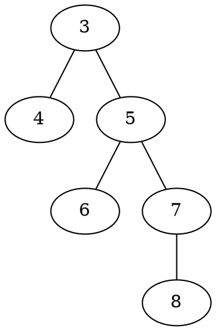
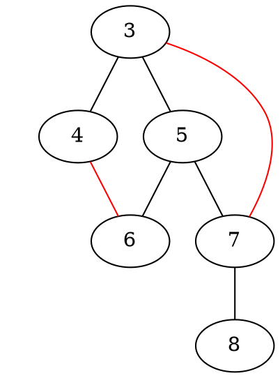
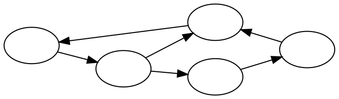
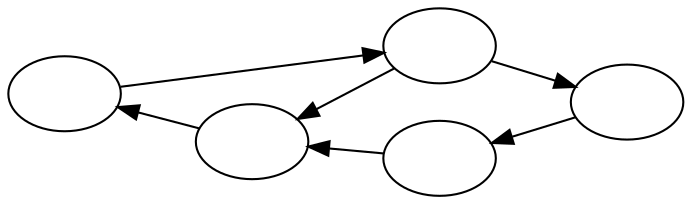
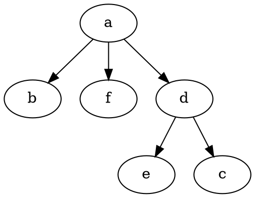
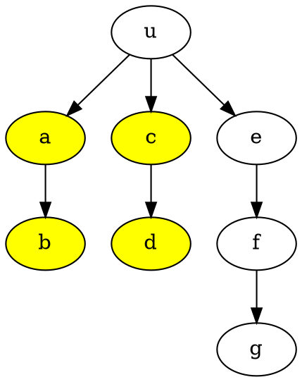
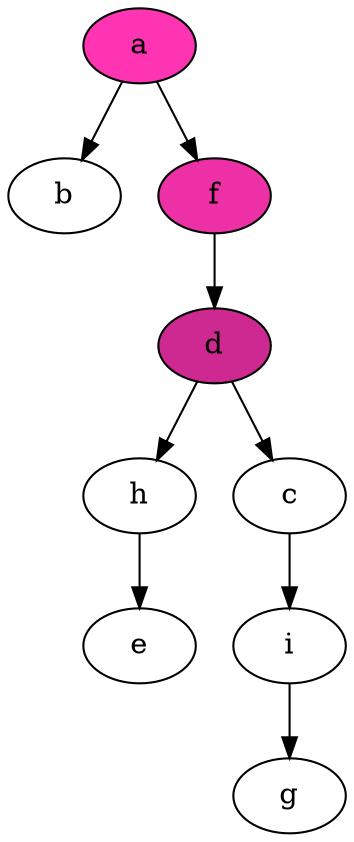
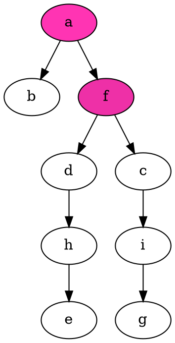

2020 Week 12: Graph
=
本主題會用到[第五週](https://hackmd.io/@nckuacm/BJ6l2P2UL)教材的內容

# Articulation point (AP)
> Articulation point 中譯 關節點

當連通圖上此**關節點**被拔除，圖會分為多塊**連通圖**
> 通常只要求此連通圖為**弱連通**的

:::info
給定連通圖，找到所有 AP
:::

考慮**樹**，顯然：
- 除**葉**以外，其餘的節點都為 AP
- 若**根**只有一個子節點，則不為 AP



如何讓 AP 不再是 AP 呢？
例如： 將 $5$ 變非 AP，可讓 $7$ 連到 $3$，及 $6$ 連到 $4$。


也就是說，若問**連通圖**中有哪些點是 AP，先遍歷出棵**樹** (例如 [DFS 樹](https://hackmd.io/@nckuacm/BJ6l2P2UL#DFS))
接著直覺的，節點的子孫**有邊**回到比此節點還高[^5] (淺)的節點，則此節點非 AP。
> 高指的是圖像的相對位置，淺指的是 depth 數字較小

而這個**連向祖先的邊**，稱作 **back edge**

## Tarjan’s algorithm for APs

實作上透過下列兩個函數，以找出所有 AP
- $\text{dep}(n)$ 代表節點 $n$ 的深度 (depth)
若節點還未拜訪過 $\text{dep}(n) = -1$
- $\text{low}(n)$ 代表節點 $n$ 透過 back edge **能連向最高節點**的深度值，
若無 back edge 則為 $\text{dep}(n)$
> low 這個詞應該是指深度較小的意思

 [^tarjamapdemo]

Tarjan 用 DFS 遍歷出樹，所以從樹來看，當節點 $u$ 的的子節點 $v$ 有 $\text{low}(v) \ge \text{dep}(u)$ 就表示拔除 $u$ 會使 $v$ 走不到更高的節點，所以 $u$ 就是此圖的 AP

實作上：
- 當有 back edge 時表示能更新 low 值
- 用父與子節點總數 `cnt` 判斷該點是否為葉節點或不為 AP 的根節點
```cpp
void dfs(int p, int u, int d) { // p := previous, d := depth
  dep[u] = low[u] = d;
  int cnt = !!d; // 待累計 u 的父與子節點總數
  bool back_error = false;

  for(int v: E[u]) if(v != p) { // v 是 u 的鄰點
    if(dep[v] != -1) {
      low[u] = min(low[u], dep[v]);
      continue;
    }
    
    cnt++;
    dfs(u, v, d+1);
    
    low[u] = min(low[u], low[v]);
    if(low[v] >= d) back_error = true; // v 沒有 back edge
  }

  if(cnt > 1 && back_error) AP.push_back(u);
}
```
> 根節點深度為 0

#### 練習：
[UVa OJ 315 Network](https://uva.onlinejudge.org/external/3/315.pdf)
[ICPC World Finals 2003 Building Bridges](https://icpcarchive.ecs.baylor.edu/external/27/2721.pdf)
[CODEFORCES 194C Cutting Figure](https://codeforces.com/contest/194/problem/C)

---

# Strongly Connected Components (SCC)
強連通是只屬於**有向圖**的概念

根據[第十一週教材](https://hackmd.io/@nckuacm/ryrA1cgdI)，
- 把圖的**方向**拿掉，連通的話稱此圖**弱連通**
- 加上方向後仍然連通，則此圖**強連通**


雖然有向圖不總有強連通性，但能把圖分成幾塊**強連通子圖**
而 SCC 要求的是分出**盡量大**的強連通子圖：
> 換句話說，就是子圖的點要盡量多
> 如果不這麼找，會有很多種分法，至少單獨一點也算強連通子圖

[^scc]

:::info
給定圖，求圖有幾塊**極大強連通子圖**
:::

## Kosaraju's Algorithm
連通意味著任兩點 $u, v$ 之間有路
那麼把 $u\leadsto v$ 的各邊反過來，對 $v\leadsto u$ 也反過來，圖理當也連通
> $u\leadsto v$ 表示 $u$ 到 $v$ 路徑

因為 $u\leadsto v$ 及 $v\leadsto u$ 兩路合併，能得到環，**環反過來還是環**
也就是說，對於強連通圖：


把邊方向反過來仍具有強連通性：


- 對於**無相圖**，[第五週教材](https://hackmd.io/@nckuacm/BJ6l2P2UL#%E7%AF%84%E4%BE%8B-UVa-OJ-572-Oil-Deposits%EF%BC%9A)提到 DFS 能判斷是否具有連通性
- 對於**有向圖** DFS 拜訪到的節點與**反邊**圖 DFS 拜訪的**節點相同**，則為強連通 
> 反邊圖就是把圖上的邊全改為反向
```cpp
void forward(int u) { // 正向 DFS
  vis[u] = true;
  for (int v = 0; v < n; v++) if (E[u][v] && !vis[v]) forward(v); // 節點編號從 0 到 n-1
  st.push(u);
}

void backward(int u, vector<int>& sub) { // 反向 DFS
  vis[u] = true;
  for (int v = 0; v < n; v++) if (E[v][u] && !vis[v]) backward(v, sub);
  sub.push_back(u);
}
```
> 這裡 `E` 是鄰接矩陣，`E[a][b]` 表示有 `a` 到 `b` 的邊


stack `st` 紀錄有哪些點是在 forward 走過，但 backward 沒走過
基於 stack 的特性，可將 forward 先一次做完，再一次次做 backward

```cpp
memset(vis, false, sizeof(vis));
for (int u = 0; u < n; u++) if (!vis[u]) forward(u); 

memset(vis, false, sizeof(vis));
while (!st.empty()) {
  int u = st.top(); st.pop();
  
  if (!vis[u]) {
    vector<int> sub; // sub := subgraph
    backward(u, sub);
    SCC.push_back(sub);
  }
}
```

#### 練習：
[ICPC Regionals 2008 Taipei Road Networks](https://icpcarchive.ecs.baylor.edu/external/42/4262.pdf)
[UVa OJ 247 Calling Circles](https://uva.onlinejudge.org/external/2/247.pdf)
## Tarjan's algorithm for SCCs
與找圖中 [articulation point](#Articulation-point) 時類似，要利用到 DFS 樹的觀念
但不能使用 $\text{dep}$ 函數，必須換成 $\text{dfn}$，定義為
- $\text{dfn}(n)$ 代表節點 $n$ 的 DFS 走訪順序
若節點還未拜訪過 $\text{dfn}(n) = 0$
- $\text{low}(n)$ 代表節點 $n$ 透過 back edge **能連向最高節點**的 dfn 值，
若無 back edge 則為 $\text{dfn}(n)$
> **最高**指的是 dfn 數字最小

 [^tarjan-scc]

連通圖是由環所構成的，且要找的是極大的連通子圖，所以當：
- $\text{low}(n) < \text{dfn}(n)$ 表示有 back edge 能連通到更高的節點
- $\text{low}(n) = \text{dfn}(n)$ 表示 $n$ 已經是極大連通子圖的最高節點

在實作上，會使用 stack `st` 記錄[^dfs_record]目前搜索中的節點，
對於連通兩點 $u, v$，從高處往低處搜索有 $u \leadsto v$，則透過 back edge 才會有 $v \leadsto u$；
故搜索時欲建立 back edge 時，並不會考慮 `st` 中以外的節點
> 提醒，建立 back edge 就是在更新 low 值

```cpp
void dfs(int u) {
  dfn[u] = low[u] = ++stamp; // stamp 為走訪時間戳
  st.push(u);
  in_st[v] = true; // v 已在 st 中

  for(int v: E[u]) {
    if(dfn[v]) {
      if(in_st[v]) low[u] = min(low[u], dfn[v]);
      continue;
    }

    dfs(v);
    low[u] = min(low[u], low[v]);
  }

  if(low[u] == dfn[u]) { // 符合條件，將子圖分出去
    vector<int> sub; // sub := subgraph
    do {
      int v = st.top(); st.pop();
      in_st[v] = false; // v 移出 st
      sub.push_back(v);
    } while(v != u);

    SCC.push_back(sub);
  }
}
```

$\text{dfn}(x) = 0$ 表示 $x$ 還未搜索過，所以對於該 $x$ 都要去做 DFS：
```cpp
for(int u = 0; u < n; u++) if(!dfn[u]) dfs(u); // 節點編號從 0 到 n-1
```

#### 練習：
:::warning
證明 Tarjan's algorithm for SCCs 不能用 $\text{dep}$ 取代 $\text{dfn}$
:::
:::warning
證明 [Tarjan's algorithm for APs](#Tarjan’s-algorithm-for-APs) 可以用 $\text{dfn}$ 取代 $\text{dep}$
:::
[UVa OJ 11838 Come and Go](https://uva.onlinejudge.org/external/118/11838.pdf)

---

# Lowest Common Ancestor (LCA)
給定一棵樹，
若節點 $a$ 滿足其**孫子節點**有 $u, v$ 或是 $a = u$ 或 $a = v$，則稱 $a$ 為 $u, v$ 的**共同祖先**
而共同祖先中**離根節點最遠**或說**深度最深**的節點稱作 $u, v$ 的**最近**共同祖先


如上圖 $e, c$ 的共同祖先有 $a, d$，**最近**共同祖先為 $d$；而 $a, b$ 的共同祖先為 $a$

:::info
求**某節點對**的最近共同祖先 (LCA)
:::

## Tarjan's off-line algorithm for LCA
> 又是你啊！Tarjan？

以 DFS 這棵樹，走到某節點 $u$ 時，會將一些子樹走訪完，接著再往下個子樹走訪
明顯的，**走訪完的子樹**上的節點與下個子樹上的節點的 LCA 就是 $u$


如圖，黃色部分是走訪完的子樹，接著要往 $e$ 走訪，那麼 $e, f, g$ 與黃色節點的 LCA 就為 $u$


實作上：
- 會將遇到的子樹節點都記錄起來，再與下個要走的子樹節點互相配對
- 使用 Union-Find Forest 查詢走訪完的子樹根節點為何 (就是 LCA)
```cpp
void dfs(int u = root) {
  for(int v = 0; v < n; v++)
    if(vis[v]) LCA[u][v] = LCA[v][u] = find(v);

  for(int v = 0; v < n; v++) if(E[u][v]) { // 假設此為有向樹
    vis[v] = true;
    dfs(v);
    group[v] = u; // v 子樹都拜訪完就與父節點 u 做 Union
  }
}
```
> 這裡 `E` 是鄰接矩陣，`E[a][b]` 表示有 `a` 到 `b` 的邊

這樣 $O(|V|^2)$ 複雜度就將**所有節點對**的 LCA 都找完了


#### 練習：
[SPOJ POLICEMEN Police Men](https://www.spoj.com/problems/POLICEMEN)

## Jump-pointer algorithm

上圖 $e, g$ 的共同祖先有 $a, f, d$，其中 $d$ 是 LCA
可觀察到任意兩節點 $u, v$ 的 LCA 的**祖先們**一定是 $u, v$ 的共同祖先

於是若 $u, v$ 的深度相同時，讓**兩者同時往上走**，**第一次遇到**的共同祖先就是 LCA
而不失一般性若 $u$ 深度大於 $v$，只要先讓 $u$ 往上走到跟 $v$ **相同的深度**就行了
如上圖欲找 $e, g$ 的 LCA，先讓 $g$ 走到與 $e$ 深度相同的 $i$，接著兩者走到 $h, c$，再走到 $d$


### 倍增法
> 又是你啊！？二進制？？

LCA 與兩節點的距離一定是整數，整數可由 $2$ 的幂 $\{2^i \mid i \ge 0\}$ 獨立[^indenpendency]和成
所以只需將每節點 **$2$ 的幂距離的祖先節點**記錄起來，再透過這些距離跳到 LCA 就行了



如上圖找 $e, g$ 的 LCA，
看出距離為 $3 = 2^1 + 2^0$，先以距離 $2^1$ 跳到 $d, c$，再以距離 $2^0$ 跳到 $f$

實作上用陣列值 `an[u][i]` 表示與 $u$ 距離為 $2^i$ 的祖先節點
```cpp
memset(an, -1, sizeof an); // 初始 -1 表示該祖先節點可能不存在
```

將每個節點的**深度**以及距離 $2^i$ 的**祖先節點**都記錄起來
```cpp
void dfs(int u, int d) { // d := depth
  dep[u] = d;
  
  for(int v: E[u]) { // 假設此為有向樹
    an[v][0] = u; // v 的父節點為 u
    for(int i = 1; i <= log2(d+1); i++) // 最高只到根
      if(an[v][i-1] != -1) an[v][i] = an[an[v][i-1]][i-1]; // 倍增距離找祖先

    dfs(v, d+1);
  }
}
```

接著就能算某節點對 $u,v$ 的 LCA 為何：
```cpp
int LCA(int u, int v) {
  if(dep[u] < dep[v]) swap(u, v);

  while(dep[u] != dep[v]) { // 將 u 往上跳至 v 同樣深度
    int i = log2(dep[u] - dep[v]);
    u = an[u][i];
  }

  if(u == v) return u;

  for(int i = log2(dep[u]); i >= 0; i--) // 將 u, v 跳至 LCA 下方
    if(an[u][i] != an[v][i]) u = an[u][i], v = an[v][i];

  return an[u][0];
}

```

#### 練習：
[POJ 1330 Nearest Common Ancestors](http://poj.org/problem?id=1330)
[ICPC Regionals 2010 Hangzhou Traffic Real Time Query System](https://icpcarchive.ecs.baylor.edu/external/48/4839.pdf)
[TIOJ 1163 6.施工中的道路](https://tioj.ck.tp.edu.tw/problems/1163)


[^5]: 所謂的比較高，意思是距離根比較近
[^tarjamapdemo]: [Wikipedia/ A demo of Tarjan's algorithm to find cut vertices.](https://en.wikipedia.org/wiki/Biconnected_component#/media/File:TarjanAPDemoDepth.gif)
[^scc]: [Wikipedia/ Graph with strongly connected components marked](https://en.wikipedia.org/wiki/Strongly_connected_component#/media/File:Scc.png)
[^tarjan-scc]: [Wikipedia/ Tarjan's Algorithm Animation](https://en.wikipedia.org/wiki/Tarjan%27s_strongly_connected_components_algorithm#/media/File:Tarjan's_Algorithm_Animation.gif)
[^dfs_record]: 也可以嘗試將搜索到的節點留給 DFS 函數
[^indenpendency]: 每個幂最多取一次