2020 Week 5: Graph Structures
=

本週要繼續介紹些基本的資料結構
並且接下來將使用這些資料結構構造(解釋)一些演算法

> 底下的術語挺多的，各位不須馬上就得記起來，等到未來碰到再回來多複習幾遍

# Graph
圖 (Graph)，是一個由邊 (Edge) 集合與點 (Vertex) 集合所組成的資料結構


圖的術語：
* 點 (vertex)： 組成圖的最基本的元素
* 邊 (edge)： 點與點的關係
* $u$ 的鄰點 (neighbors)： $u$ 透過一個邊連到的所有點
* 有向圖 (directed graph)： 邊帶有**方向**性
* 無向圖 (undirected graph)： 每條邊都是**雙向**的
* 道路 (walk[^7])： 點邊相間的序列， e.g. $v_0e_1v_1e_2v_2..e_nv_n$
* 行跡 (trail)： **邊不重複**的道路
* 路徑 (path)： **點不重複**的道路[^8]
* 環 (cycle)： 路徑的**起**點與**終**點連接後形成環
* 度 (degree)： 與該點連接的邊數量 (無向性)
* 入度 (in-degree)： 連到該點的邊數量 (方向性)
* 出度 (out-degree)： 該點往外連的邊數量 (方向性)
* 走訪/遍歷 (traversal/search)： 走完全部的點或邊

> 口語上常會把路徑表示成道路，但根據多數的圖論書籍，這兩者定義是不同的

在討論圖的邊，常會有 $u$ 是邊起點與 $v$ 是邊終點的慣例用符
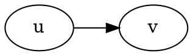
> 上面這就是一種有向圖

## 圖的儲存

通常圖用鄰接表 (adjacency list) 或鄰接矩陣 (adjacency matrix) 儲存資料
### 鄰接表
```cpp
struct edge { int u, v, w; }; // 兩個相鄰點與邊權重
vector<edge> E;

int main() {
    :
    .
  while(M--) {
    scanf("%d%d%d", &u, &v, &w);
    E.push_back({u, v, w});
  }
}
```
直接紀錄所有邊(兩點與權重)

或是
```cpp
struct vertex { int v, w; }; // 鄰點與邊權重
vector<vertex> E[MAXN];

int main() {
    :
    .
  while(M--) {
    scanf("%d%d%d", &u, &v, &w);
    E[u].push_back({v, w});
  }
}
```
為每個點紀錄其所有鄰點與之間的權重


### 鄰接矩陣
```cpp
int E[MAXN][MAXN];

int main() {
    :
    .
  while(M--) {
    scanf("%d%d%d", &u, &v, &w);
    E[u][v] = w;
  }
}
```
為每對點紀錄邊的關係 (有無權重可代表是否有邊)
> 使用鄰接矩陣要注意空間成本

---
# Tree

樹 (Tree)，這個資料結構在圖像化看起來像顆倒掛的[樹](https://zh.wikipedia.org/wiki/%E6%A0%91)，根在上，而葉子在下。


樹的術語及特點：
* 樹是種**有向無環連通圖**
* 節點 (node)： 樹上的點不使用圖的術語：點 (vertex)
* 父 (parent)： 節點能**反向**拜訪的**第一個**節點
* 子 (child)： 節點能**正向**拜訪的**第一個**節點
* 祖先 (ancestor)： 節點能反向拜訪的所有節點
* 孫子 (descendant)： 節點能正向拜訪的所有節點
* 根 (root)： 沒有父節點的節點
* 葉 (leaf)： 沒有子節點的節點
* 深度 (depth)： 節點的深度為從根到該節點所經過的邊數
* 森林 (forest)： 一個集合 包含所有不相交的樹
* ==**每個非根節點只有一個父節點**==

> 在數學上的圖論領域，通常樹是種**無向**無環的連通圖

## 樹的儲存
將節點本身的資料，以及連接的其他節點位置以 `node` 結構保存下來
```cpp
struct node {
  int val; // value
  node *ch1, *ch2, *ch3, *ch4;
  // vector<node*> ch;
} 
```


---

# Union-Find Forest (併查森林)

考慮設計一個結構，
它要能存放一些集合，且這些集合之間**沒有相同元素**
這樣的集合族稱作 **Disjoint sets**
> Disjoint sets 通常應用在"**分類**"問題中

直觀的想法是將每個**集合有哪些元素**，用陣列或連結串列紀錄起來
而常見的集合操作有，新增、刪除、(取)聯集、取交集(?)、取集合大小
>可以思考一下這些操作的複雜度要多少

但併查森林則是將紀錄方式從 "集合有哪些元素" 改為 "**元素屬於哪個集合**"


## Initialization
```cpp
for (int v = 1; v <= N; v++) group[v] = v;
```
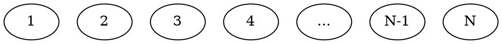

## Find
Find 會尋找某個元素屬於哪個集合

```cpp
int Find(int v) {
  if (v == group[v]) return v;
  return Find(group[v]);
}
```
假設有元素 $1$ ~ $5$，其中 $1,2$ 一組，$3,4,5$ 一組。
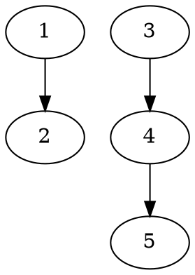
下 `Find(5)` 指令，那麼他要回傳給我 $3$

### Path Compression

稍微想像一下可發現，若樹長這樣：
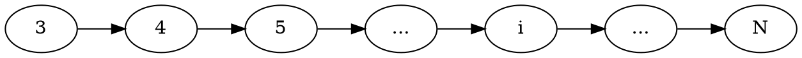
那麼明顯 `Find(i)` 的複雜度為 $O(N)$

直覺的，如果樹不是長得這麼長，而是**一個個節點**都直接接在 $3$ 底下
那麼 `Find(i)` 的複雜度似乎就能下降了。
所以每當回溯時就順便把最上層 group 的標號[^10](也就是 $3$) 給所有拜訪完的節點 $i$

也就是改寫為：

```cpp
int Find(int v) {
  if (v == group[v]) return v;
  return group[v] = Find(group[v]); // Path Compression
}
```

於是原本的森林下 `Find(5)` 指令

森林會變成：
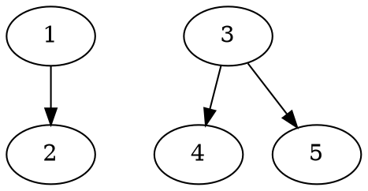


## Union
Union 會將兩個集合合併起來 (再次提醒：此集合族是 disjoint 的)
```cpp
void Union(int u, int v)
  { group[Find(u)] = Find(v); }
```
若對下圖這樣的情況，做 `Union(4, 2);` 也就是將 $4$ 的 root $3$ 合併到 $2$ 的 root $1$

則上圖會變為下圖這樣：
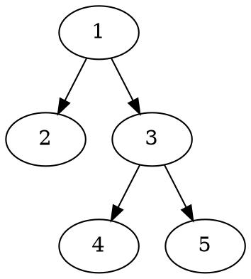

還有種方式稱作 [Union by rank/size](https://en.wikipedia.org/wiki/Disjoint-set_data_structure#Union)，將 rank/size 小的樹合併到 rank/size 大的樹下，可以加快許多。


#### 範例 [UVa OJ 879 Circuit Net](https://uva.onlinejudge.org/external/8/879.pdf)：
```cpp    int u, v;
cin.ignore(); // for getline
while (getline(cin, pins)) {
  if (pins.empty()) break; // for getline

  stringstream sin(pins);
  while (sin >> a >> b) Union(a, b);
}

int cnt = 0;
for (int i = 1; i <= N; i++) if (group[i] == i) cnt++;
```

>`std::stringstream` 是很方便的東西，不過據說效率不夠優。

#### 練習：
[UVa OJ 10583 Ubiquitous Religions](https://uva.onlinejudge.org/external/105/10583.pdf)
[UVa OJ 11987 Almost Union-Find](https://uva.onlinejudge.org/external/119/11987.pdf)
[TIOJ 1192 鑰匙設計](https://tioj.ck.tp.edu.tw/problems/1192)
[CODEFORCES 1253D Harmonious Graph](https://codeforces.com/contest/1253/problem/D)

# 搜尋
有了圖，有了樹，可以開始討論這回事了

不彷將搜尋所能觸及到的 可能性/目標 稱為**狀態**
每當狀態改變後，前個狀態到下個狀態的過程稱**狀態轉移**。
若把狀態看作**點**，而狀態轉移看作**邊**，包含這些點與邊的**圖**稱作**狀態空間**

回憶一下上面曾介紹的術語：
* 走訪/遍歷 (traversal/search)： 走完全部的點或邊

遍歷也是種搜尋，但"走完"可能得付出龐大的時間成本，或是空間成本
根據狀態空間規模，須用一些手段使得能更快速的找到所想要的東西。


本章使用的圖論符號慣例：
- $V$ (Vertex) 表節點集合，表達單一點常用 $u$, $v$
- $E$ (Edge) 表邊集合，通常起點用 $u$、終點用 $v$ 作為點符號
> $u \to v$ 邊可寫成 $(u, v) \in E$


# DFS
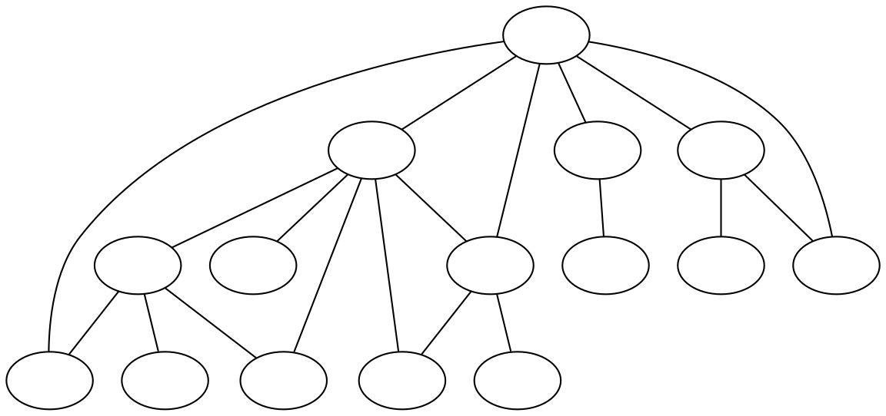

深度優先搜尋 (Depth-first Search/DFS)：走訪為每拜訪一點就往其一鄰點拜訪下去。
==這裡的走訪為走遍所有**點**(而非邊)==，若中途碰到曾走過的點不往下繼續走。[^dfs-1]
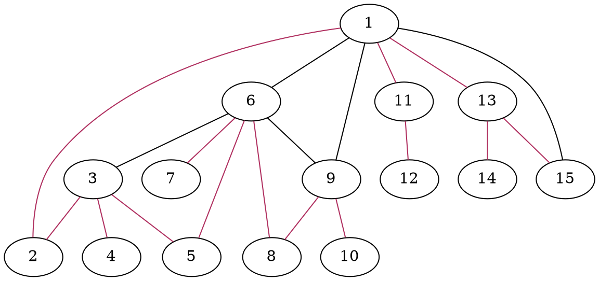
按照上圖，走訪**順序**為 $1$ 依照自然數列開始走訪到 $15$。

DFS 走過的道路為**樹**，稱此樹為 DFS 樹：
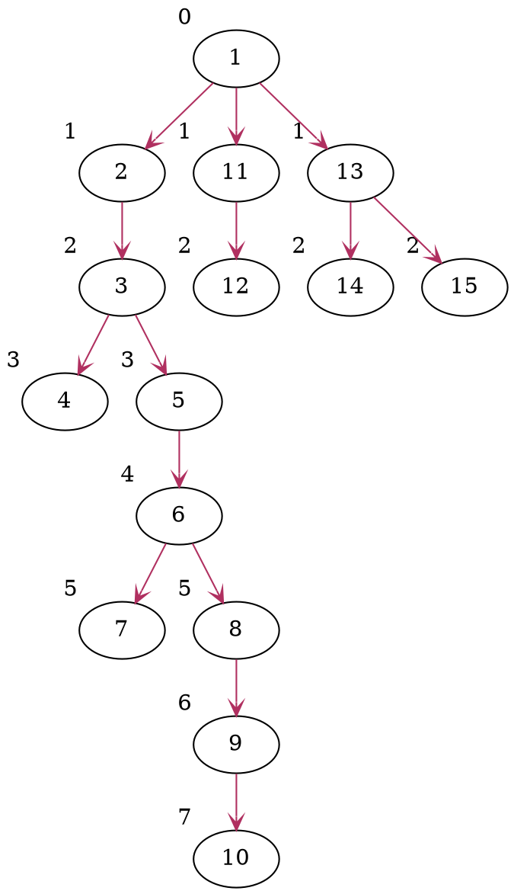
(圖上節點左上角的數字代表深度)

```cpp
void dfs(int u, int dep) { // dep := depth
  for (int v: E[u]) {
    if (vis[v]) continue;
    vis[v] = true;
    dfs(v, dep+1);
  }
}
```
> 這裡 for 迴圈採用 [Range-based](https://en.cppreference.com/w/cpp/language/range-for) 寫法

其中 `vis[i]`[^convention] 為 `true` 代表此點已**拜訪完**，下次遇到此點直接略過。
所以在開始進行走訪前，將起點設為**拜訪完**：
```cpp
vis[root] = true; // root 代表走訪此圖的起點
dfs(root, 0);
```

DFS 除了能夠以上述遞迴方式呈現，也可以採用 **stack** 來實作：
```cpp
stack<tuple<int, int, int>> S;
S.emplace(root, 0, 0);
vis[root] = true;

while (!S.empty()) {
  auto [u, cur, dep] = S.top(); S.pop(); // cur := current index

  for (int i = cur; i < E[u].size(); i++) {
    int v = E[u][i];
    if (vis[v]) continue;

    vis[v] = true;
    S.emplace(u, i, dep);
    S.emplace(v, 0, dep+1);
    break;
  }
}
```

## 狀態空間搜尋[^dfs-2]
搜尋某個**狀態**，可以利用**函式**與**參數**表示，例如會把 `f(1, 2, 3)` 和 `f(3, 4, 5)` 這樣的函式呼叫，當作不同的狀態去接觸(求解)它。

#### 範例 [UVa OJ 572 Oil Deposits](https://uva.onlinejudge.org/external/5/572.pdf)：

題目要求一個區域中有幾個**連通**圖
所謂的連通，就是圖中任意兩點間至少有一條路徑

當接觸到 `dfs(r, c)` 這個狀態時，代表這裡有塊包含座標 $(r, c)$ 的 oil deposit (前提是 `plot[r][c]` 為 `'@'`)
而 DFS 走訪時，只需確保不再重複走到走過的點，所以走過就設 `'*'`
```cpp
void dfs(int r, int c) {
  if (plot[r][c] == '*') return;
  plot[r][c] = '*';

  for (int dr = -1; dr <= 1; dr++)
    for (int dc = -1; dc <= 1; dc++) //雙重迴圈讓八個方位都走
      if (r+dr >= 0 && r+dr < m && c+dc >= 0 && c+dc < n)
        dfs(r+dr, c+dc);
}
```

*只要是連通圖，DFS 都能把此圖走訪完*
這裡簡單算走進幾次連通圖就好
```cpp
int count = 0;
for (int i = 0; i < m; i++)
  for (int j = 0; j < n; j++)
    if (plot[i][j] == '@') { dfs(i, j); count++; }
```


# BFS

廣度優先搜尋 (Breadth-first Search/BFS)：走訪為每拜訪一節點就將其全部鄰點拜訪過。
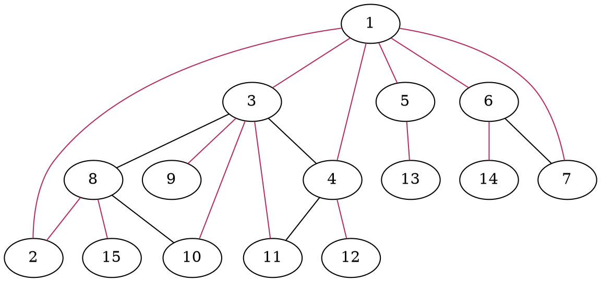
按照上圖，走訪**順序**為 $1$ 依照自然數列開始走訪到 $15$。

對於一個**點**，會經歷以下階段：
1. 未拜訪：不曾進入隊列
2. 拜訪中：進入隊列
3. 拜訪完：離開隊列

則 BFS 的流程為：
1. 將起點(root)加入隊列中
2. 每次將一個拜訪中的點 $u$ 的所有**未拜訪鄰點**加進隊列，而 $u$ 就此拜訪完畢
3. 重複動作 2. 直至隊列為空
> 若圖是連通圖，則 BFS 會將所有點都拜訪過
```cpp
queue<int> Q;
Q.push(root); //root 代表走訪此圖的起點
vis[root] = true;

while (!Q.empty()) {
  int u = Q.front(); Q.pop();
  
  for (auto& v: E[u]) {
    if (vis[v]) continue;
    vis[v] = true;
    Q.push(v);
  }
}
```
> 根據條件應將不合法的走法濾掉，在 `Q.push()` 之前可判斷一下。
>BFS 跟 DFS 結構只差在 stack 和 queue，除此之外兩者是非常相似的


與 DFS 同樣，由於不會走訪曾走過的點，所以 BFS 走完後也會有個 BFS 樹：
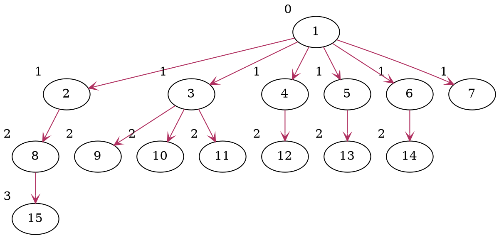

## 最短步數
搜索地圖**起點到任意點**的最短步數/路徑，
例如地圖上 `*` 代表牆(不能走)，`$` 代表路，`%` 是起點，`@`是終點
且每一步只走上下左右一格：
```
*  *  *  *  *  *  *  *  *  *  
*  *  *  *  $  %  $  $  *  *  
*  $  $  $  $  *  *  $  *  *  
*  $  *  $  *  *  *  $  *  *  
*  $  *  $  $  $  *  $  *  *  
*  $  *  $  *  $  $  $  *  *  
*  $  $  *  *  $  *  $  $  *  
*  *  $  $  $  *  *  *  $  *  
*  @  *  *  $  *  $  $  $  *  
*  $  *  *  $  *  $  *  $  *  
*  $  $  $  $  $  $  *  *  *  
*  *  *  *  *  *  *  *  *  *  
```
BFS 可以應用在這[^bfs-1]：
```haskell
*  *  *  *  *  *  *  *  *  *  
*  *  *  *  1  0  1  2  *  *  
*  5  4  3  2  *  *  3  *  *  
*  6  *  4  *  *  *  4  *  *  
*  7  *  5  6  7  *  5  *  *  
*  8  *  6  *  8  7  6  *  *  
*  9  10 *  *  9  *  7  8  *  
*  *  11 12 13 *  *  *  9  *  
*  21 *  *  14 *  12 11 10 *  
*  20 *  *  15 *  13 *  11 *  
*  19 18 17 16 15 14 *  *  *  
*  *  *  *  *  *  *  *  *  *  
```
其中上面數字代表**深度**。
這個走法就跟[粘菌走迷宮](https://www.youtube.com/watch?v=czk4xgdhdY4)同樣


#### 範例 [UVa OJ 11624 Fire!](https://uva.onlinejudge.org/external/116/11624.pdf)：

最開始先將 Joe 與各火點放進 queue 中，以便讓 BFS 以此為起點走訪：
```cpp
for (int r = 0; r < R; r++) {
  scanf("%s", input);
  for (int c = 0; c < C; c++) {
    if (input[c] == '#') maze[r][c] = 0;
    if (input[c] == '.') maze[r][c] = INF;
    if (input[c] == 'J') J.push({r, c, 0}), maze[r][c] = INF, vis[r][c] = true;
    if (input[c] == 'F') F.push({r, c, 0}), maze[r][c] = 0;
  }
}
```
(其中 `INF`[^convention] 為一個非常大的數字，例如 `int` 的上限)

Joe 不能被火燒到，所以 Joe 一定要**走得比火快**
由此，算出各點何時火會燒過來就能判斷 Joe 是否能比火先到

搜尋火到各點的**最短路**：
```cpp
while (!F.empty()) {
  point f = F.front(); F.pop();

  for (int d = 0; d < 4; d++) {
    int nr = f.r+dr[d], nc = f.c+dc[d];
    if (nr == R || nc == C || nr < 0 || nc < 0 || maze[nr][nc] != INF || maze[nr][nc] == 0) continue;
    
    maze[nr][nc] = f.t + 1;
    F.push({nr, nc, f.t+1});
  }
}
```
其中 `point` 結構三個變數為 **r**ow, **c**olumn 與 **t**ime (火抵達的時間)
並利用 dr 與 dc 以當前所在點走遍四個方向：
```cpp
              /* 左, 右, 下, 上 */
int const dr[] = {0, 0, -1, 1};
int const dc[] = {-1, 1, 0, 0};
```

現在 maze (也就是地圖) 上有紀錄火到的時間了。
接下來讓 Joe 去尋找最短路：

```cpp
int escape = -1;
while (!J.empty()) {
  point j = J.front(); J.pop();
  if ((j.r == R-1 || j.c == C-1) || (j.r == 0 || j.c == 0)) {
    escape = j.t + 1;
    break;
  }

  for (int d = 0; d < 4; d++) {
    int nr = j.r+dr[d], nc = j.c+dc[d];
    if (vis[nr][nc] || j.t + 1 >= maze[nr][nc]) continue;
    
    vis[nr][nc] = true;
    J.push({nr, nc, j.t+1});
  }
}
```
`j.t + 1 >= maze[nr][nc]` 就能看 Joe 走這點是不是會被火燒
最後判斷走到邊界，就成功逃脫了！

#### 練習：
[UVa OJ 532 Dungeon Master](https://uva.onlinejudge.org/external/5/532.pdf)
[STEP5 0127 攻略妹妹](http://web2.ck.tp.edu.tw/~step5/probdisp.php?pid=0127)
[UVa OJ 11234 Expressions](https://uva.onlinejudge.org/external/112/11234.pdf)
[UVa OJ 1599 Ideal Path](https://uva.onlinejudge.org/external/15/1599.pdf)
\* [CODEFORCES 1307D Cow and Fields](https://codeforces.com/problemset/problem/1307/D)

# Backtracking
>利用各種可得的限制來做搜尋目標中的偷吃步

八皇后問題[^bt-1]：西洋棋盤上任意擺放八個皇后彼此都不互攻的情況有幾種？

如下圖是其中一種合法的擺法
 [^bt-1]


若想著把每一種任意擺放可能性列出來，再來挑選可行的盤面，
將有 $\binom{64}{8} = 4426165368$[^combination] 種盤面要產，明顯的程式會跑很久

而兩個皇后放在同個 row 或 column 上一定會互攻，所以只需在每個 row 或 column 擺放一個皇后就好：
```cpp
int dfs(int row) {
  if (row == 8) return 1;
  
  int sum = 0;
  for (int col = 0; col < 8; col++)
    if (check(row, col)) {
      board[row] = col; // 在 (row, col) 放置一個皇后
      sum += dfs(row + 1);
    }
  
  return sum;
}
```
這邊的 `check(r, c)` 就是本節的主題了，
在轉移狀態(盤面)前，若能預感(?)這狀態不是想要的，就中斷轉移，然後 backtrack 到原狀態，繼續進行別的狀態轉移

用 `check(r, c)` 檢查將皇后放置在 $(r, c)$ 後是否能繼續再放置其他皇后。

用點幾何概念的話，會發現 `check()` 只需要 $O(N = 8)$ 就能做到：

```cpp
bool check(r2, c2) {
  for (int r1 = 0; r1 < r2; r1++) {
    int c1 = board[r1];
    if (c1 == c2 || c1-c2 == r1-r2 || c1-c2 == r2-r1) return false;
  }
  
  return true;
}
```
枚舉的盤面會少於 $N!$ 很多，因為 `check()` 剪掉了許多不必再繼續遞迴下去的 DFS 樹枝。

[^bt-2]

#### 練習：
[UVa OJ 524 Prime Ring Problem](https://uva.onlinejudge.org/external/5/524.pdf)
[UVa OJ 211 The Domino Effect](https://uva.onlinejudge.org/external/2/211.pdf)


[^7]: 看英文 walk 這字，帶有一種隨意的感覺，是種無限制的路
[^8]: 很多人無法很好的區分道路與路徑，甚至行跡，通常得仔細讀上下文

[^10]: 這邊容易誤會，因為 disjoint sets tree 的"根"，是我們進行遞迴下探走到的"葉"。


[^convention]: 這個變數將成為以後的慣例

[^dfs-1]: 注意，這裡的圖剛好是連通的。
[^dfs-2]: [State space search](https://en.wikipedia.org/wiki/State_space_search)

[^bfs-1]: 有時間可以玩玩看 [pipes](https://github.com/ccns/105-club-fair-game-problems/tree/master/1/2)，裡頭有附上 source code

[^bt-1]: [Wikipedia/ Eight queens puzzle](https://en.wikipedia.org/wiki/Eight_queens_puzzle)
[^bt-2]: [Mathworks/ The Eight Queens Problem](https://blogs.mathworks.com/steve/2017/04/20/the-eight-queens-problem/)
[^CE]: 不過實驗證明，提交上 Codeforces 會拿到 Compilation error

[^combination]: 就是組合 $C$ $64$ 取 $8$ 的意思