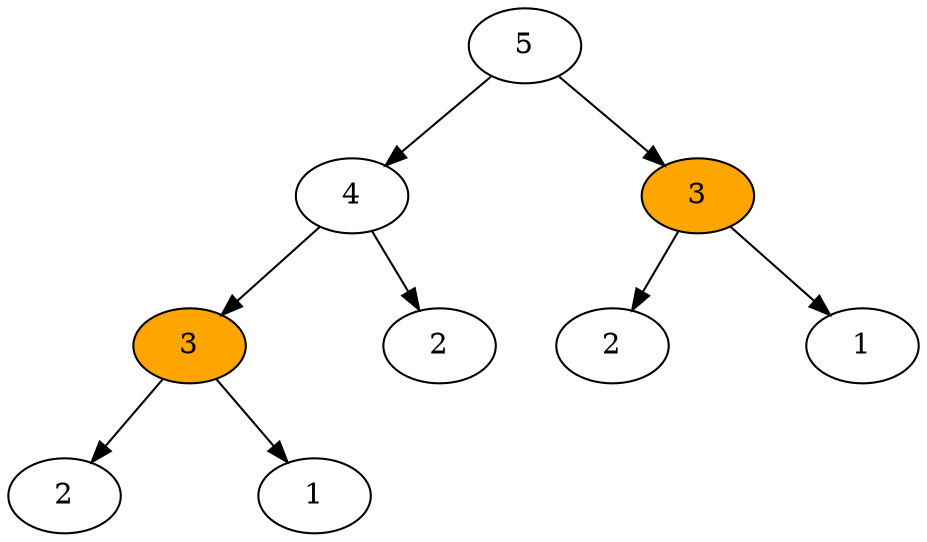
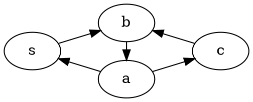

# 2020 Week 7: Dynamic Programming (動態規劃)
[第三週教材](https://hackmd.io/@nckuacm/r1ZEy4ar8#%E5%88%86%E6%B2%BB%E6%B3%95)中分治法，提到了每個子問題都需**互相獨立**，就是每分割都將產生全**新**的問題
而本次介紹的動態規劃則適合在大部分的問題**互相重疊**

回憶教材中的那段話： "從邊界遞推地紀錄所有問題的解，且一個項用到前一項的最佳結果，就是動態規劃的精神。"

這裡給出正式的定義：
問題若能用 Dynamic Programming (以下簡稱 DP) 求解，其該問題含有以下三個性質：

* 最優子結構
問題的**最優解**，是由**子問題**們的最優解推得。其子問題也具有同樣的特性
* 重複子問題
有很多子問題可歸為**同樣**的問題
* 無後效性
確定的子問題解，並不會受到其他決策影響(還在整個問題的求解過程中)

==DP 不滿足[第一週教材](https://hackmd.io/@nckuacm/BJD15vyrI#%E4%BB%80%E9%BA%BC%E6%98%AF%E6%BC%94%E7%AE%97%E6%B3%95)中提到的演算法三步驟，它僅是個方法==

# DP 入門
考慮一個問題
:::info
要買價值 $x$ 元的商品，有 $10$ 元、$5$ 元、$1$ 元硬幣，要求花**最少**的**硬幣數**。
:::
日常生活中有個**貪心策略**是，每次用額面較大的硬幣去付
這樣就能使用較少的硬幣數，例如 $x = 15$ 就是 $\underline{1}\cdot 10 + \underline{1}\cdot 5 + \underline{0}\cdot 1$，只要花 $2$ 個硬幣

:::info
若現在硬幣額面只有 3 種分別為 $11$ 元、$5$ 元、$1$ 元
:::
顯然上述貪心策略就不是最佳策略了。

設 $f(x)$ 為價值 $x$ 元的商品所需要的最少硬幣數
例如 $x = 15$，若第一次：
- 選 $11$ 元則硬幣數為 $f(4) + 1$
- 選 $5$ 元則硬幣數為 $f(10) + 1$
- 選 $1$ 元則硬幣數為 $f(14) + 1$

所以從三種方案中挑**最小值**即可，則將問題以 $f$ 形式化後：
$$f(x) = \min\{f(x-11), f(x-5), f(x-1)\} + 1$$

也就是說，求解 $f(x)$ 需要用到 3 個**子問題的解**：
$$f(x-11), f(x-5), f(x-1)$$

以及邊界：
$$f(0) = 0$$
> $0$ 元只需 $0$ 個硬幣

### 最優子結構
$f(x)$ 的定義為湊出 $x$ 元的**最少**硬幣數
最少即 $f(x)$ 的**最優解**，而 $f(x)$ 仰賴 3 個子問題的最優解

### 無後效性
若求出了 $f(4) = 4$，則不管**未來**要求任何 $f(t)$ 的解都**不會改變** $f(4)$ 的解

### 重複子問題
若求 $f(9)$ 則需要先求解 $f(8), f(4)$
$f(4)$ 在之前**可能**已經找到解了，這就是**重複**的子問題
也就是說**無需**再為 $f(9)$ 重新計算 $f(4)$

---

在繼續往下讀前，先複習[第五週教材](https://hackmd.io/@nckuacm/BJ6l2P2UL#%E6%90%9C%E5%B0%8B)中關於搜尋的術語

# 經典 DP 問題
有非常多實用的演算法是使用 DP 方法所設計的，
比起學習這些演算法的實作，更重要的是要學習如何**應用 DP** 去**設計**出演算法
同時在介紹經典問題的解法中，會順便引入一些基本的實作技巧。

## [LeetCode 509 Fibonacci Number](https://leetcode.com/problems/fibonacci-number/)
:::info
**數列**由 $0, 1$ 開始，之後的數為前兩項相加得來
也就是 $0,1,1,2,3,5,8,13,21,\cdots$

求數列第 $n\in \mathbb{N}$ 項的數
:::


直接根據問題規則，用遞迴寫：
```cpp
int solve(int n) {
  if (n == 0 || n == 1) return n; // 邊界
  return solve(n-1) + solve(n-2);
}
```
第 $n = 0$ 數直接為 $0$，第 $n = 1$ 數為 $1$，在這之後的數由第 $n-1$ 與 $n-2$ 數和成
而**每個子問題**都將分為兩個子問題，複雜度為 $O(2^n)$

而實際上此演算法將**同樣**的子問題計算過兩次以上
例如在 $n = 5$ 時，會重複計算 `solve(3)` 兩次:


### 記憶化 (memoization[^memoization])

也就是說，只要在每次解出子問題後將結果**記錄**，下一次遇到**重複**的子問題就無需計算
複雜度改進為 $O(n)$

### Top-down
由原問題開始遞歸逐步計算子問題的解
```cpp
int solve(int n) {
  if (n == 0 || n == 1) return n;
  if (fib[n]) return fib[n];
  return fib[n] = solve(n-1) + solve(n-2); // memoization
}
```
- 較好實作
- 不會計算太多子問題
- 較不需著重於求解順序
- 呼叫函式的成本頗高

### Bottom-up
由邊界(最小子問題)逐步計算到原問題的解
```cpp
fib[0] = 0;
fib[1] = 1;
for (int i = 2; i <= n; i++) fib[i] = fib[i-1] + fib[i-2];
```
- 容易設計適當的迭代順序以優化空間/時間
- 較容易掌握複雜度
- **可能**會多計算無用的子問題


#### 練習：
[CODEFORCES 327A Flipping Game](https://codeforces.com/contest/327/problem/A)
[CODEFORCES 1033C Permutation Game](https://codeforces.com/problemset/problem/1033/C)

## [LeetCode 377 Combination Sum IV](https://leetcode.com/problems/combination-sum-iv/)
:::info
給 $m$ 長數列 $a$，求只靠這些數和成 $N$ 的方法數
:::
例如給 $a = (1, 2, 3)$ 以及 $N=4$ 那麼
$N = 1+1+1+1 = 1+1+2 = 1+2+1 = 2+1+1 = 1+3 = 3+1 = 2+2$
和成 $N$ 的方法數為 $7$

觀察到某數累加至 $N$ 時，唯一的**決策**是**要加哪個數**
並且加上一個數後，**原本的和變成了別的和**。

這給了動機去設計狀態 $dp(N)$ 表示和為 $N$ 的方法數
則狀態轉移為 $dp(N) = \sum\limits_{i=1}^m dp(N-a_i)$
> 因為 $(N-a_i)$ 只要加上 $a_i$ 就會變為 $N$

最開始所有問題待求解，預設為 $0$
> 因為方法數是從 $0$ 開始累加來的

且已知邊界為 $dp(0) = 1$
> 和為 $0$ 的方法數，直接就是 $1$
```cpp
memset(dp, 0, sizeof dp);
dp[0] = 1;
```

### Pulling
求 $dp(x)$ 的解時，若狀態計算順序 $x$ 由小至大
則 $\forall i\centerdot dp(x-a_i)$ 的解*早已得知*，所以這些解能推得 $dp(x)$
> 因為 $\forall a_i > 0$ 則 $x-a_i < x$
```cpp
for (int x = 1; x <= N; x++)
  for (int i = 1; i <= m; i++)
    if (x-a[i] >= 0) dp[x] += dp[x-a[i]];
```


### Pushing
由已知的狀態解，去更新還未得解的狀態解
```cpp
for (int x = 0; x < N; x++)
  for (int i = 1; i <= m; i++)
    dp[x+a[i]] += dp[x];
```
同樣計算狀態從小到大，那麼當迭代至 `dp[x]` 時，已經被**較小**的的狀態更新完了


#### 練習：
[NCKU OJ 8 彩彩劈瓦](https://oj.leo900807.tw/problems/8)
\* [CODEFORCES 1133E K Balanced Teams](https://codeforces.com/contest/1133/problem/E)


## [NCKU OJ 22 爬樓梯 k](https://oj.leo900807.tw/problems/22)
:::info
從第 $0$ 階開始，**每次**可爬 $1$ 或 $2$ 階，求不超過 $k$ 次到 $n$ 階的方法數
:::

回顧教材的[上樓梯問題](https://hackmd.io/@nckuacm/r1ZEy4ar8#%E7%AF%84%E4%BE%8B-LeetCode-70-Climbing-Stairs%EF%BC%9A)

```cpp
dp[0] = dp[1] = 1;
for(int i = 2; i <= n; i++) dp[i] = dp[i-1] + dp[i-2];
```

造成答案變動的**決策**有每次要走 $1$ 階還是走 $2$ 階的選擇
但是 $dp(i)$ 依舊沒辦法紀錄是否走了 $k$ 次或是正往 $k$ 次邁進
不妨就多為**目前走了幾次**新增一個狀態 $dp(i, j)$

由於走一次會從當前 $j-1$ 次變為 $j$，轉移為 
$$
dp(i, j) = 
\begin{cases}
dp(i-1, j-1) + dp(i-2, j-1) &\text{if } j \le \min(i, k) \\
0 &\text{otherwise}
\end{cases}
$$
> $j$ 不能超過 $k$ 次，也沒辦法用 $i$ 次以上走到第 $i$ 階樓梯

邊界為 $dp(0, 0) = dp(1, 1) = dp(2, 1) = 1$
> $dp(0, 0) = 1$ 表示站在地板不需要走就是一種方法

最終答案為 $\sum\limits_{j=0}^k dp(N, j)$

```cpp
dp[0][0] = dp[1][1] = dp[2][1] = 1;

for(int i = 2; i <= N; i++)
  for(int j = 2; j <= min(k, i); j++)
    dp[i][j] = dp[i-1][j-1] + dp[i-2][j-1];

int sum = 0;
for(int j = 0; j <= k; j++) sum += dp[N][j];
```
> 在求解過程中，變數可能會溢位


## 單源最短路徑
:::info
給定圖 $G=(E, V)$，以及對於每個有向邊 $(u, v) \in E$ 有邊權重 $w(u, v)$
給定起點 $s$，求 $s$ 到任意點的最短路徑權重總和
:::

直接定義狀態 $\delta(v)$ 表示 $s$ 到 $v$ 的最短路權重和
那麼觀察到當已知從 $s$ 到 $a$ 的最短路權重和為 $\delta(a)$
則 $a$ 的所有**鄰點** $b$ 能夠被他更新，也就是：
```cpp
for(auto [b, w]: E[a]) // E[a] 紀錄 a 的鄰點 b 以及邊權重 w
  delta[b] = min(delta[b], delta[a] + w);
```
> 這就是種 pushing 轉移

反過來說，對於 $b$ 的所有**入點** $a$ 有 $\delta(b) = \min\limits_{(a, b) \in E} \delta(a) + w(a, b)$
> 這就是種 pulling 轉移

如果圖出現**環**怎辦？
例如：


$\delta(c)$ 狀態的 pulling 轉移依賴關係為 $\delta(c) \to \delta(a) \to \delta(b) \to \delta(c)$
會發現要求 $\delta(c)$ 要先求得 $\delta(c)$ 的解，怎麼求？

發生這個原因就是因為**環**，所以需設法使圖為**無環 (DAG)**
**再多加一個狀態**或是改變狀態*求解的順序*，可藉此改變依賴關係的路徑

設狀態 $\delta(k, v)$ 表示用至多 $k$ 個邊從 $s$ 到 $v$ 的最短路總和
則狀態轉移為 $\delta(k, v) = \min\limits_{(u, v)\in E} \delta(k-1, u) + w(u, v)$，
且 $\forall k \le 0\centerdot\delta(k, v)$ 無解，除了 $\delta(k, s) = 0$

這樣轉移的依賴關係就不會出現環了。

```cpp
int dfs(int k, int v) {
  if(delta[k][v] != INF) return delta[k][v];
  if(k <= 0) return INF; // 無解

  for(auto [u, w]: E[v]) // E[v] 紀錄 v 的入點 u 以及邊權重 w
    delta[k][v] = min(delta[k][v], dfs(k-1, u) + w);

  return delta[k][v];
}
```
> 用 `INF` 表示無解或**尚未得解**

計算 $s$ 到各點的最短路總和：
```cpp
memset(delta, 0x3f, sizeof delta); // INF := 0x3f3f3f3f, 表示尚未得解
for(int k = 0; k < V.size(); k++) delta[k][s] = 0; // 邊界

for(int v: V) dfs(V.size()-1, v);
```
`V.size()-1` 由於對於任意點，$s$ 最多只需透過 $|V|-1$ 條邊就能走到

#### 練習：
[Kickstart 2018 Round B No Nine](https://codingcompetitions.withgoogle.com/kickstart/round/0000000000050ff4/0000000000051183)


## 背包問題
:::info
給固定體積的背包，以及各**種**體積 $V_i$ 及價值  $P_i$ 不盡相同的物品
在背包容量不超過體積上限的前提，使總價值**最大**。
:::

經典的背包問題有以下幾類:
- 無限背包問題：
對每**種**物品，其個數是**無限**多個
- 01 背包問題：
對每**種**物品，其個數是 $1$ 個
- 多重背包問題：
對每**種**物品，其個數是**有限**多個

<!-- 
先用一個比較生活化的例子來說，假設有一個古代的東方商人想沿著絲路走至西方販賣珍奇古物，但是他當然沒辦法將所有店內的商品帶去，所以為了最大化此趟旅程所能賺到的錢，他必須在他的大後背包內放入總價值最多的商品 
>對沒錯，他要用走的

假設他的大背包容量為 $8$ 公升，以下是一些他想帶去販售的商品:

|Index|價值|體積|
|---|---|---|
|1|$10$ 克朗|$2$ L|
|2|$80$ 克朗|$3$ L|
|3|$110$ 克朗|$4$ L|
|4|$150$ 克朗|$5$ L|
|5|$200$ 克朗|$6$ L|


以商品都能賣出去為前提，請問該怎麼帶才能最大化收益呢？

在進入正題前，讀者可以先思考一下這個看起來似乎蠻簡單的問題
要使得總價值最大不就是先算好各物品的 C/P 值，然後從最高的開始挑起嗎？
這樣做會發生什麼事？ 最佳解又是多少？ -->


## 01 背包問題

<!-- 例如：
|價值|體積|
|---|---|
|$70$ 克朗|$2$ L|
|$80$ 克朗|$4$ L|
假設剩下 $4$ L 的體積，無限背包問題中會選兩個 $2$ L 的商品；
但在 01 背包問題中，只能選擇 $4$ L 的商品 -->


**狀態** $S(i, n)$ 表示**只**考慮 $1$ 到 $i$ 項物品，背包體積為 $n$ 時的最大價值。
這個最大值，是下列兩項其中之一
- 包含第 $i$ 個物品： $S(i-1, n - V_i) + P_i$
- 不包含第 $i$ 個物品： $S(i-1, n)$

也就是**狀態轉移**方程：
$$ S(i, n) = \max(S(i-1, n - V_i) + P_i, S(i-1, n))$$
而當背包體積小於 $V_i$ 時，
$$S(i, n) = S(i-1, n)$$

假設固定體積 $N$ 的背包，且有 $C$ 種物品考慮，利用上述觀念來寫：
```cpp
for (int n = 0; n <= N; n++) S[0][n] = 0; // 還未考慮任何物品時

for (int i = 1; i < C; i++)
  for (int n = 0; n <= N; n++) {
    if (n >= V[i])
      S[i][n] = max(S[i-1][n], S[i-1][n-V[i]] + P[i]);
    else
      S[i][n] = S[i-1][n];
  }
```

### 空間優化
狀態定義 $S(n)$ 代表目前背包體積為 $n$ 的最大價值
然後面對第 $i$ 個物品，考慮該不該拿，其中狀態轉移方程：
$$S(n) = \max(S(n-V_i) + P_i)$$
```cpp
for (int i = 1; i < C; i++)
  for (int n = N; n >= V[i]; n--)
    S[n] = max(S[n], S[n-V[i]] + P[i]);
```
這裡有個重點：
```cpp
for (int n = N; n >= V[i]; n--)
```
此順序必須為**從大到小**，
舉個反例，若當 $S(n-V_i)$ 決定拿 $i$ 物品， $S(n)$ 也決定拿 $i$ 物品
由於若 $S(n) = S(n-V_i) + P_i$，這樣 $S(n)$ 相當於**拿了兩次** $i$ 物品，違反 01 背包問題前提。
> 這個優化叫做滾動陣列


#### 範例 [UVa OJ 10465 Homer Simpson](https://uva.onlinejudge.org/external/104/10465.pdf)：

:::info
辛普森先生吃 Krusty 漢堡需要 $m$ 時間，Apu’s Kwik-e-Mar 漢堡則需要 $n$ 時間

給定 $t$ 時間，辛普森先生**不想浪費**任何時間，無時無刻得一直吃漢堡，求辛普森先生在 $t$ 結束前能吃的最多漢堡數。
如果一定得浪費時間，辛普森先生可以喝啤酒(?)

要求輸出辛普森先生在時限內可以吃進**最多**的漢堡數，若可以喝啤酒，則需要再輸出浪費多少時間。
:::

:::spoiler

因為每種漢堡可以吃無限多個，但 01 背包問題限制**每種只能選一次**
也就是說，只要**創造**更多種漢堡就好！

對於原本的漢堡
創造出個數(價值)為 $2, 3, ..$，以及吃的時間(體積)為 $m\cdot 2, m\cdot 3, \cdots$ 的多種漢堡(物品)

不過各位學過二進制都知道，只需要 $1, 2, 4, 8, \cdots$ 就可以做出任意正整數
```cpp
int C = 1;

for (int i = 0; m * pow(2, i) <= t; i++) {
  V[C] = m * pow(2, i);
  P[C] = pow(2, i);
  C++;
}

for (int i = 0; n * pow(2, i) <= t; i++) {
  V[C] = n * pow(2, i);
  P[C] = pow(2, i);
  C++;
}
```
轉成背包問題的術語後，
定義狀態 $S(i, n)$ 表示只考慮 $1$ 到第 $i$ 種物品、背包體積 $n$ 且**不浪費**任何體積的最大價值
則狀態轉移方程：
$$ S(i, n) = \max(S(i-1, n),S(i-1, n - V_i) + P_i)$$
但當 $n$ 小於 $V_i$ 或 $S(i-1, n-V_i)$ **無解**時，
$$S(i, n) = S(i-1, n)$$
$S(x, y)$ 無解的意思是： 背包體積為 $y$ 時，選 $x$ 物品一定得**浪費**體積！
而邊界為 (當背包體積為 $0$)：
$$ \forall i\centerdot S(i, 0) = 0$$

上段創造了 $C$ 種物品，利用上述觀念來寫：
```cpp
for (int i = 1; i < C; i++)
  for (int n = 0; n <= t; n++)
    S[i][n] = (n==0)? 0 : -1;

for (int i = 1; i < C; i++)
  for (int n = 0; n <= t; n++) {
    if (n >= V[i] && S[i-1][n-V[i]] != -1)
      S[i][n] = max(S[i-1][n], S[i-1][n-V[i]] + P[i]);
    else
      S[i][n] = S[i-1][n];
  }
```
其中 `-1` 代表還未得解或無解的狀態。

接著看浪費多少體積：
```cpp
for (int n = t; n >= 0; n--) if (S[C-1][n]) {
  printf("%d", S[C-1][n]);
  if (n < t) printf(" %d", t-n);
  putchar('\n');
  break;
}
```
:::

#### 練習：
[UVa OJ 624 CD](https://uva.onlinejudge.org/external/6/624.pdf)
[UVa OJ 10130 SuperSale](https://uva.onlinejudge.org/external/101/10130.pdf)
[UVa OJ 10819 Trouble of 13-Dots](https://uva.onlinejudge.org/external/108/10819.pdf)

## 無限背包問題
首先設計出此問題的**狀態定義**：
$S(n)$ 狀態表示在背包體積為 $n$ 時的最大價值
> 最好盡可能簡單直覺


假設背包體積為 $n-V_i$，則加入第 $i$ 個物品後，總價值為：
$$S(n-V_i) + P_i$$
所以，**狀態轉移方程**為：
$$S(n) = \max_i(S(n - V_i) + P_i)$$
> 對於解 $S(n)$，每次討論 $i$ 物品時，子問題都需先得到最優解
> 也就是 $S(n-V_i)$ 要先得到最優解，才能求解 $S(n)$

假設有 $C$ 種物品，利用上述觀念來寫：
```cpp
memset(S, 0, sizeof S); // 還未挑任何物品的初始化

for (int i = 1; i <= C; i++)
  for (int n = V[i]; n <= N; n++)
    S[n] = max(S[n], S[n-V[i]] + P[i]);
```
與 01 背包的[空間優化](#空間優化)版本相反，這裡 $n$ 順序該**從小到大**
> 理解這段程式碼得先看懂 01 背包的空間優化

#### 範例 [UVa OJ 10465 Homer Simpson](https://uva.onlinejudge.org/external/104/10465.pdf)：

:::spoiler

與 01 背包問題的範例一樣：
```cpp
memset(S, -1, sizeof S);
S[0] = 0;

for (int j = m; j <= t; j++) if (S[j-m] != -1) S[j] = max(S[j], S[j-m] + 1);
for (int j = n; j <= t; j++) if (S[j-n] != -1) S[j] = max(S[j], S[j-n] + 1);
```

接著看浪費多少時間：
```cpp
for (int i = t; i >= 0; i--) if (S[i]) {
  printf("%d", S[i]);
  if (i < t) printf(" %d", t-i);
  putchar('\n');
  break;
}
```
:::


#### 練習：
[UVa OJ 10980 Lowest Price in Town](https://uva.onlinejudge.org/external/109/10980.pdf)
[POJ 2063 Investment](http://poj.org/problem?id=2063)

## Longest Common Subsequence (LCS)
Longest Common Subsequence 中譯為 最長**公共**子序列
:::info
在兩個序列 $A, B$ 中找到一個**相同**(公共)且**最長**的子序列。
:::

例如：
$A = (\textbf{1}, 4, 2, 3, 8, \textbf{3}, \textbf{4}, \textbf{1}, \textbf{9})$
$B = (0, \textbf{1}, \textbf{3}, 7, 7, \textbf{4}, \textbf{1}, 9, \textbf{9})$
則 LCS 為 $(1, 3, 4, 1, 9)$

與 LIS 類似，
若某數字在某公共子序列**後**出現，並且它為兩序列的**公共**數字，那麼加入它就能形成更長的公共子序列！
不過在那之前，這個公共序列是如何求得的？

通過上述，定義狀態 $S(n, m)$ 為以 $A_n$ 以及 $B_m$ 為**結尾**的 LCS **長度**，
則狀態轉移方程為：
$$
 S(n, m) = 
  \begin{cases} 
   S(n-1, m-1) + \textbf{1} &\text{if } A_n = B_m \\
   \max(S(n-1, m), S(n, m-1)) &\text{if } A_n \not= B_m
  \end{cases}
$$


也就是找出在 $B_m, A_n$ 之前的公共子序列，選出最長的！


假設 $A$ 序列長度為 $\text{AN}$，$B$ 序列長度為 $\text{BN}$，利用上述定義：
```cpp
for (int n = 1; n <= AN; n++)
  for (int m = 1; m <= BN; m++) {
    if (A[n] == B[m])
      S[n][m] = S[n-1][m-1] + 1;
    if (A[n] != B[m])
      S[n][m] = max(S[n-1][m], S[n][m-1]);
  }
```

一樣的，假設 $A, B$ 為
$$B = (0, \textbf{1}, \textbf{3}, 7, 7, \textbf{4}, \textbf{1}, 9, \textbf{9}) \\ A = (\textbf{1}, 4, 2, 3, 8, \textbf{3}, \textbf{4}, \textbf{1}, \textbf{9})$$
則輸出 $S$ 會長這樣 (第一個 row 為 $B$， 第一個 column 為 $A$)：
|   |   |   |   |   |   |   |   |   |   |
|---|---|---|---|---|---|---|---|---|---|
|   | 0 | <div id="lcs"> **1** </div> | <div id="lcs"> **3** </div> | 7 | 7 | <div id="lcs"> **4** </div> | <div id="lcs"> **1** </div> | 9 | <div id="lcs"> **9** </div> |
| <div id="lcs"> **1** </div> | 0 | <div id="len"> **1** </div> | 1 | 1 | 1 | 1 | 1 | 1 | 1 |
| 4 | 0 | 1 | 1 | 1 | 1 | 2 | 2 | 2 | 2 |
| 2 | 0 | 1 | 1 | 1 | 1 | 2 | 2 | 2 | 2 |
| 3 | 0 | 1 | 2 | 2 | 2 | 2 | 2 | 2 | 2 |
| 8 | 0 | 1 | 2 | 2 | 2 | 2 | 2 | 2 | 2 |
| <div id="lcs"> **3** </div> | 0 | 1 | <div id="len"> **2** </div> | 2 | 2 | 2 | 2 | 2 | 2 |
| <div id="lcs"> **4** </div> | 0 | 1 | 2 | 2 | 2 | <div id="len"> **3** </div> | 3 | 3 | 3 |
| <div id="lcs"> **1** </div> | 0 | 1 | 2 | 2 | 2 | 3 | <div id="len">**4**</div> | 4 | 4 |
| <div id="lcs"> **9** </div> | 0 | 1 | 2 | 2 | 2 | 3 | 4 | 5 | <div id="len">**5**</div> |
標上紫色的為 LCS 中的數，而粉紅則為此時的**長度**
也就是說，只要順著狀態轉移方程以及 $S$ 上的數，就能找到 LCS

```cpp
int n = AN, m = BN;

while (n && m) {
  if (S[n][m] != max(S[n-1][m], S[n][m-1])) {
    LCS.push_back(A[n]);
    n--; m--;
  }
  else if (S[n][m] == S[n-1][m]) n--;
  else if (S[n][m] == S[n][m-1]) m--;
}

reverse(LCS.begin(), LCS.end());
```


#### 練習：
[UVa OJ 10405 Longest Common Subsequence](https://uva.onlinejudge.org/external/104/10405.pdf)
[UVa OJ 10066 The Twin Towers](https://uva.onlinejudge.org/external/100/10066.pdf)
[UVa OJ 10192 Vacation](https://uva.onlinejudge.org/external/101/10192.pdf)
[UVa OJ 531 Compromise](https://uva.onlinejudge.org/external/5/531.pdf)

# Greedy method (貪心法)
>貪心法是 DP 的一種特例

回憶[第三週教材](https://hackmd.io/@nckuacm/r1ZEy4ar8#%E8%B2%AA%E5%BF%83%E6%B3%95)的那段話： 
"每次做一個在當下看起來最佳的決策，進而漸漸求出全局最佳解"

一旦**證明**問題能被貪心法解決，通常貪心法是問題的最佳策略，因為放棄搜索所有解答空間，效率會提高不少。

通常**觀察**出一個問題是否有最優子結構時
就可**假設**看看：下某個決策能漸漸朝全局最佳解的方向走
接著**證明**每次做這個決策一定不會更差
> **證明**(或直覺?)很重要，有些看似美好的假設，不見得能求得問題的解


#### 範例 [TIOJ 1072 A.誰先晚餐](https://tioj.ck.tp.edu.tw/problems/1072)：

:::spoiler

直覺是先讓**吃最慢**的人先上菜

比較看看，若 $a$ 和 $b$ 的吃速 $E_a < E_b$，煮菜速度 $C_a, C_b$

- 先讓 $a$ 上，總時間： $C_a + \max(E_a, C_b + E_b) = C_a + C_b + E_b$
- 先讓 $b$ 上，總時間： $C_b + \max(E_b, C_a + E_a)$
- 不管 $a, b$ 誰先上，其他人用餐時間都不會受到影響 (自行證明吧)

將總時間的 $C_b$ 消去後發現 $C_a + E_b$ 大於 $\max(E_b, C_a + E_a）$，
所以先讓 $b$ (吃較慢)上菜會比較快！

```cpp
#include<bits/stdc++.h>
using namespace std;

int const maxn = 1e4 + 10;

int N, C[maxn], E[maxn];

int main()
{
  while(scanf("%d", &N) && N) {
    vector<int> idx;
    for(int i = 0; i < N; i++) {
      scanf("%d%d", &C[i], &E[i]);
      idx.push_back(i);
    }

    sort(idx.begin(), idx.end(), [&](int x, int y) { return E[x] > E[y]; });

    int cook = 0, time = 0;
    for(int i: idx) {
      cook += C[i];
      time = max(time, cook + E[i]);
    }

    printf("%d\n", time);
  }

  return 0;
}
```
:::

#### 範例 [CODEFORCES 1076C Make It Equal](https://codeforces.com/problemset/problem/1065/C)：

:::spoiler

模擬切格子的步驟就行了
從最高的地方 (`maxh`) 一路一層層往最低處 (`1`) 看
```cpp
for(int i = maxh; i >= 1; i--) {
  :
  .
}
```
對於每一層，收集**該層**的**格子**們 $s$，收集完存到累計的 `sum` 中
```cpp
sum += s;
```
但是當該層的格子加進 `sum` 中會超過 $k$ 時，就不能再收集了
此時**這個位置**就是要 slice 的地方
```cpp
if(sum + s > k) slice++, sum = 0;
```

而當 $s$ 等於 $n$ 時，也就是所有 tower 都**一樣高**了，就可以結束了
```cpp
if(s == n) {
  if(sum) slice++;
  break;
}
```
這裡特別注意 `sum` 如果還有東西，表示結束前還要切一刀 (slice)

在以上步驟之前，我們還得問，如何知道**某層**的 $s$ 為何？
```cpp
for(int i = 0; i < n; i++) scanf("%d", &h), s[h]++;
for(int i = maxh; i >= 1; i--) s[i-1] += s[i];
```

以下完整解題程式碼：
```cpp
#include<bits/stdc++.h>
using namespace std;

int const maxh = 2e5 + 10;

int n, k, s[maxh];

int main()
{
  scanf("%d%d", &n, &k);

  int h;
  for(int i = 0; i < n; i++) scanf("%d", &h), s[h]++;

  for(int i = maxh-1; i >= 1; i--) s[i-1] += s[i];

  int sum = 0, ans = 0;
  for(int i = maxh-1; i >= 1; i--) {
    if(s[i] == n) {
      if(sum) ans++;
      break;
    }

    if(sum + s[i] > k) ans++, sum = 0;

    sum += s[i];
  }

  printf("%d\n", ans);

  return 0;
}
```
:::


#### 練習:
[CODEFORCES 1140D Minimum Triangulation ](https://codeforces.com/problemset/problem/1140/D)
[ZEROJUDGE d652 貪婪之糊](https://zerojudge.tw/ShowProblem?problemid=d652)
[ZEROJUDGE d133 00357 - Let Me Count The Ways](https://zerojudge.tw/ShowProblem?problemid=d133)
[TIOJ 1861 蘿莉切割問題](https://tioj.ck.tp.edu.tw/problems/1861)
[TIOJ 1636 錢包的路](https://tioj.ck.tp.edu.tw/problems/1636)
[STEP5 0021 背包問題](http://web2.ck.tp.edu.tw/~step5/probdisp.php?pid=0021)


[^memoization]: 這單字並沒有拼錯。

<style>

#len{
  width: 100%;
  height: 100%;
  background-color: #FFAAAA;
  color: #D91C21;
}
#lcs{
  width: 100%;
  height: 100%;
  background-color: #C7B6EC;
  color: #655091;
}
table.part tbody tr td  {
  text-align: center;
  line-height: 36.5px;
  padding: 0 0 0 0;
}
</style>
