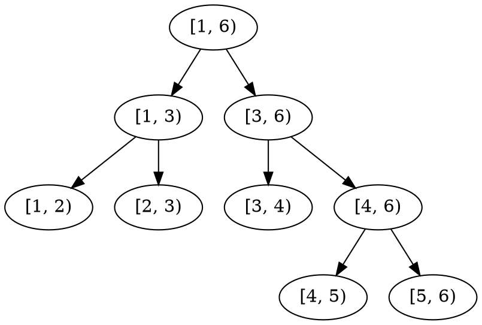
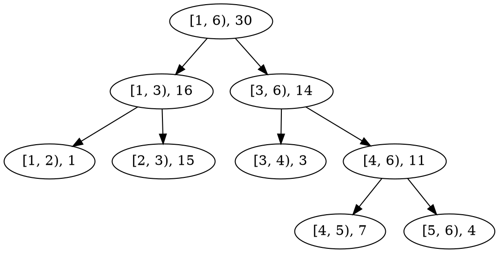
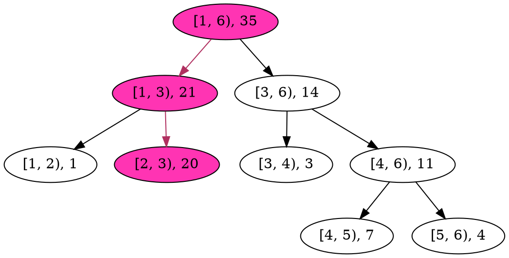
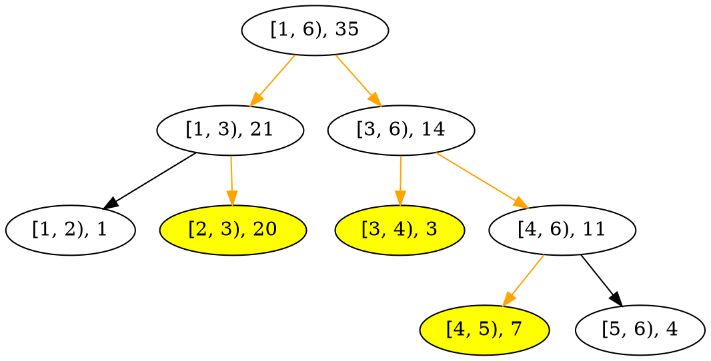
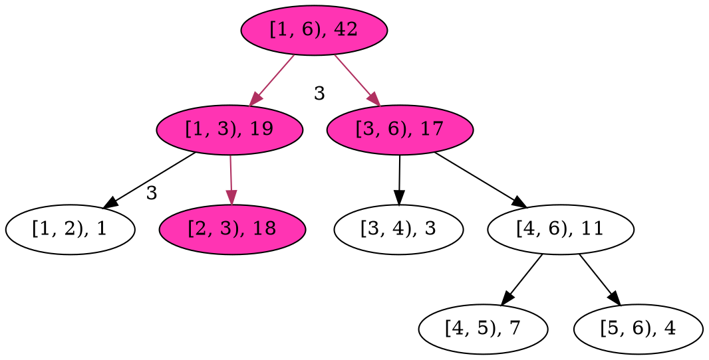
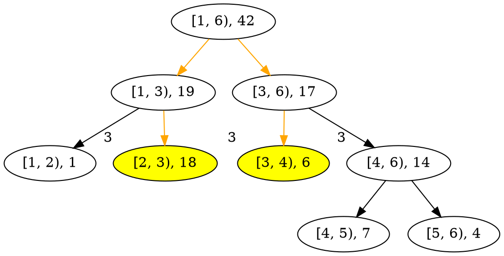

# 2020 Week 9: Data Structures
本篇將介紹些 CP 值較高的資料結構
> 其中 C 代表的是 coding 複雜度，~~或把 CP 譯作競程~~

# Sparse Table: RMQ
RMQ 全名 Range Maximum/Minimum Query
:::info
給定長度 $n$ 的數列 $a$，查詢**任意區間**極(最大/最小)值
:::
> 樸素的枚舉區間會有 $O(n^2)$ 的查詢複雜度

不失一般性，下面只以找**最大值**為例

定義狀態 $ST(i, k)$ 表示數列從 $i$ 位置開始，長度 $2^k$ 區間 $[i, i+2^k)$ 所有數中最大值
> 例如 $a = (1, 2, 5, 7, 2)$ 則 $ST(1, 1) = 5$，位置從 $0$ 開始

最大值可從**更小**的長度 $2^{k-1}$ 兩個區間比較得來，起點分別在 $i$ 與 $i+2^{k-1}$ 
則狀態轉移為 $ST(i, k) = \max(ST(i, k-1), ST(i+2^{k-1}, k-1))$

而邊界為長度 $1 = 2^0$ 區間 $ST(i, 0) = a_i$

```cpp
for(int i = 0; i <= n; i++) ST[i][0] = a[i];

for(int k = 1; k <= log2(n); k++)
  for(int i = 0; i+(1<<k) <= n; i++)
    ST[i][k] = max(ST[i][k-1], ST[i+(1<<k-1)][k-1]);
```
> 建構 Sparse Table 的時間複雜度為 $O(n\cdot\log_2 n)$，

如此能利用 $k = \lfloor\log_2(R-L) \rfloor, \max(ST(L, k), ST(R-2^k, k)$ 求得區間 $[L, R)$ 的最大值

> 注意這裡區間表示方式是**左閉右開**符號

#### 練習：
[ZEROJUDGE d539 區間 MAX](https://zerojudge.tw/ShowProblem?problemid=d539)
[TIOJ 1603 胖胖殺蚯事件](https://tioj.ck.tp.edu.tw/problems/1603)

---

# 線段樹 (Range/Interval/Segment Tree)
> 線段樹是各種區間問題的絕招，相較其他延伸應用 本節只是冰山一角
> 建議先熟悉[第三週的分治法](https://hackmd.io/@nckuacm/r1ZEy4ar8)以及[第五週的合併排序法](https://hackmd.io/@nckuacm/BJqhqDnL8)再閱讀本節

先考慮一個非常眼熟(?)的問題
:::info
給定數列 $a$，有 $Q$ 個操作包括：**更新**數列上的值或是**查詢**一個解
:::

針對更新哪些值，以及查詢哪些解，精確的分類可分為：
- 單點更新/單點查詢
- 單點更新/區間查詢
- 區間更新/單點查詢
- 區間更新/區間查詢

而所謂要求的**解**(答案)可能有：
- 極大/小值
- 總和 (或其他運算結果)


線段樹，顧名思義就是以保存很多區間解的一顆樹，例如數列長度 $5$：

> 注意這裡區間表示方式是**左閉右開**符號

## 單點更新/區間查詢
先明確的以簡單的問題設計簡單的線段樹
:::info
給定長度 $N$ 的數列 $a$，有 $Q$ 個操作包括：
- 將數列上的**一個數加上** $d_i$
- 查詢一個**區間的總和**
:::
例如 $a = (1, 15, 3, 7, 4)$，$Q = 3$ 筆詢問為：
將 $a_2$ 加上 $5$ 則 $a = (1, 20, 3, 7, 4)$
將 $a_5$ 加上 $1$ 則 $a = (1, 20, 3, 7, 5)$
詢問區間 $[2, 5)$ 的值，則區間總和為 $30$


### Node
線段樹的節點保存該區間的解，以及左右子節點的位置
```cpp
struct node {
  int sum;
  node *lc, *rc; // left child, right child
  node() { sum = 0; lc = rc = NULL; }
};
```

### Build
根據給定數列把初始線段樹造出來
```cpp
node* build(int L, int R) {
  node* u = new node();
  if(R-L == 1) { // 區間中只剩一個數，也就是葉節點
    u->sum = a[L];
  } else {
    int M = (L+R) / 2;
    u->lc = build(L, M); // 左子樹
    u->rc = build(M, R); // 右子樹
    
    u->sum = u->lc->sum + u->rc->sum;
  }
  
  return u;
}
```
以 $a = (1, 15, 3, 7, 4)$ 為例，線段樹會長這樣

區間旁的數代表總和，例如區間 $[4, 6)$ 的總和為 $11$

### Update
將數列中某位置 $i$ 的數加上 $d$
```cpp
void update(node* u, int L, int R, int i, int d) {
  if(i < L || i >= R) return; // 未包含欲更新位置
  u->sum += d;
  
  if(R-L == 1) return; // 葉節點
  
  int M = (L+R) / 2;
  update(u->lc, i, d, L, M);
  update(u->rc, i, d, M, R);
}
```

以前個樹為例，將 $a_2$ 加上 $5$：


每次只往包含 $i = 2$ 位置的區間遞迴下去，複雜度為 $O(\log_2 N)$

### Query
查詢區間 $[qL, qR)$ 的總和
```cpp
int query(node* u, int L, int R, int qL, int qR) {
  if(R <= qL || qR <= L) return 0; // 不在欲查詢區間內
  if(qL <= L && R <= qR) return u->sum;
  
  int M = (L+R) / 2;
  return query(u->lc, L, M, qL, qR) + query(u->rc, M, R, qL, qR);
}
```
以前個樹為例，詢問區間 $[2, 5)$ 的總和：


這樣的遞迴查詢，每一層最多只會往下遞迴兩個節點，所以複雜度為 $O(\log_2 N)$
> 利用反證法能證明當某層往下遞迴**超過兩個節點**會出現矛盾

#### 練習：
[HDU OJ 1166 敌兵布阵](http://acm.hdu.edu.cn/showproblem.php?pid=1166)
[CODEFORCES 339D Xenia and Bit Operations](https://codeforces.com/contest/339/problem/D)
\*[CODEFORCES 1253E Antenna Coverage](https://codeforces.com/problemset/problem/1253/E)


## 區間更新/區間查詢
變得棘手一些的問題
:::info
給定長度 $N$ 的數列 $a$，有 $Q$ 個操作包括：
- 將**一個區間**中數列上的數每個都**加上** $d_i$
- 查詢一個**區間的總和**
:::
例如 $a = (1, 15, 3, 7, 4)$，$Q = 2$ 筆詢問為：
將 $[2, 6)$ 加上 $3$ 則 $a = (1, 18, 6, 10, 7)$
詢問 $[2, 4)$ 的值，則區間總和為 $24$

可採用前面提的"單點更新/區間查詢"線段樹，
更新區間內的所有數，可對每數都單點更新，但總複雜度為 $O(Q\cdot N\log_2 N)$

也可這樣寫：
```cpp
void update(node* u, int L, int R, int qL, int qR, int d) {
  if(R <= qL || qR <= L) return;
  if(R-L == 1) {
    if(qL <= L && R <= qR) u->sum += d; // 葉節點在更新區間內
    return;
  }
  
  int M = (L+R) / 2;
  update(u->lc, L, M, qL, qR, d);
  update(u->rc, M, R, qL, qR, d);
  
  u->sum = u->lc->sum + u->rc->sum;
}
```
可是複雜度仍然為 $O(Q\cdot N\log_2 N)$

> 這甚至比暴力的枚舉區間的數還來得差 :-1:


### Lazy tag
顧名思義，就是懶
> 懶是工程師的美德

由於更新區間的總和同時也將其子節點一併更新，這麼*勤快*肯定會花不少時間
如果當前區間的數**全都得更新**，可先偷懶做個 tag 值表示下方的子孫節點還未更新上 tag，
等到**真正需要**查(遞迴)到其子孫節點，在將 tag 往下**推給子節點**，以完成更新


### Node
線段樹的節點保存該區間的解，以及左右子節點的位置
```cpp
struct node {
  int sum, tag;
  node *lc, *rc;
  node() { sum = tag = 0; lc = rc = NULL; }
  void pull() { sum = lc->sum + rc->sum; }
  void push(int L, int R) {
    lc->tag += tag;
    rc->tag += tag;
    
    int M = (L+R) / 2;
    lc->sum += tag * (M-L);
    rc->sum += tag * (R-M);
    
    tag = 0;
  }
};
```
- `pull()` 將左右子區間的總和加起來
- `push()` 將該區間的 tag 給左右子區間，並完成子節點的更新


### Update

```cpp
void update(node* u, int L, int R, int qL, int qR, int d) {
  if(R <= qL || qR <= L) return;
  if(qL <= L && R <= qR) {
    u->sum += d * (R-L);
    u->tag += d;
    return;
  }
  
  u->push(L, R);
  
  int M = (L+R) / 2;
  update(u->lc, L, M, qL, qR, d);
  update(u->rc, M, R, qL, qR, d);
  
  u->pull();
}
```

以 $a = (1, 15, 3, 7, 4)$ 為例將 $[2, 6)$ 所有數加上 $3$：

其中左上角的值代表 tag 值。


### Query

```cpp
int query(node* u, int L, int R, int qL, int qR) {
  if(R <= qL || qR <= L) return 0;
  if(qL <= L && R <= qR) return u->sum;
  u->push(L, R);
  
  int M = (L+R) / 2;
  return query(u->lc, L, M, qL, qR) + query(u->rc, M, R, qL, qR)
}
```

以前個樹為例，詢問區間 $[2, 4)$ 的總和：


#### 練習：
[POJ 3468 A Simple Problem with Integers](http://poj.org/problem?id=3468)
[CODEFORCES 52C Circular RMQ](https://codeforces.com/contest/52/problem/C)

---

# Binary Indexed Tree
> 又叫做 Fenwick Tree

翻譯為二元索引樹，可看作是線段樹的特化版本

## 二進制
整數可由一些 $2$ 的冪 $\{2^x \mid x \ge 0\}$ 組成，且每種冪次可**只用一次**
例如 $7 = 1 + 2 + 4$，二進制表示為 $111 = 001 + 010 + 100$
每個數字可由這種方式**唯一的表示**。換句話說，兩個不同數字就得用不同方式表現

也就是說用 $(001, 010, 100)$ 表達成 $111$ 也沒問題
那麼用 $111, (001, 010)$ 表達同一件事也可以
把 $,$ 換成 $-$ 用 $111 - 001 - 010$ 表達也能吧？

## $\text{lowbit}(x)$
$\text{lowbit}(x)$ 指的是 $x$ 用二進制表示時最小的 bit 表式的 $2$ 的冪
$x = 7$ 以二進制表達 $\text{lowbit}(111) = 001$
$x = 6$ 以二進制表達 $\text{lowbit}(110) = 010$
$x = 4$ 以二進制表達 $\text{lowbit}(100) = 100$

#### 練習：
:::warning
證明二補數系統下運算 `x&-x` 是 $x$ 的 lowbit
:::
:::warning
設 $y = x+\text{lowbit}(x)$ 證明 $y-\text{lowbit}(y)+1 \le x-\text{lowbit}(x)+1$
:::

## 單點更新/區間查詢
有了以上的基礎，可以回到正題了
:::info
給定長度 $N$ 的數列 $a$，有 $Q$ 個操作包括：
- 將數列上的**一個數加上** $d_i$
- 查詢**一個區間的總和**
:::

如果只有查詢操作，
那麼直接透過前綴和 $S$ 做 $S(R) - S(L-1)$ 就能求得 $[L, R]$ 區間和了
但問題還得考慮更新操作，所以**普通的前綴和**肯定是不行的
> 複雜度會過高

根據前面基礎，用 `for(; x >= 1; x-=lowbit(x)) sum += BIT[x]` 求得 $[1, x]$ 區間和
例如 $x = 7$ 那麼 `sum` 會得到 `BIT[7] + BIT[6] + BIT[4]`
這其實就是把 $[1, 7]$ 區間和表達成 $111 - 001 - 010$
兩者結合就是：`BIT[`$111$`] + BIT[`$111-001$`] + BIT[`$111-001-010$`]`

而其中 `BIT[x]` 就能構造為 $[x-\text{lowbit}(x)+1, x]$ 的總和  $\sum\limits_{i=x-\text{lowbit}(x)+1}^x a_i$
例如 $[1, 7]$ 的總和就是 $\sum\limits_{i=1}^4 a_i + \sum\limits_{i=5}^6 a_i + \sum\limits_{i=7}^7 a_i = \sum\limits_{i=1}^7 a_i$

`BIT` 這種奇特區間定義能表示成一棵樹，例如 $[1, 8]$ 的樹：


而若要更新數列的數，也要把包含此數的區間一併更新
例如更新位於位置 $x$ 的數，則 $[x-\text{lowbit}(x)+1, x]$ 要更新
$y = x+\text{lowbit}(x), [y-\text{lowbit}(y)+1, y]$ 也會包含 $x$ 位置，也得更新，依此類推

### Update
單點更新
```cpp
void update(int p, int d)
  { for(; p <= N; p+=p&-p) BIT[p] += d; }
```
複雜度為 $O(\log N)$，由於每次 lowbit 會至少進 1 位

### Query
求前綴和
```cpp
int pre(int p) {
  int sum = 0;
  for(; p >= 1; p-=p&-p) sum += BIT[p];  
  return sum;
}
```
複雜度為 $O(\log N)$，因為每次會去掉一個 bit

練習：
[CODEFORCES 356A Knight Tournament](https://codeforces.com/contest/356/problem/A)
[CODEFORCES 459D Pashmak and Parmida's problem](https://codeforces.com/contest/459/problem/D)
[CODEFORCES 1042D Petya and Array](http://codeforces.com/contest/1042/problem/D)
[TIOJ 1175 Longest Increasing Subsequence](https://tioj.ck.tp.edu.tw/problems/1175)
[TIOJ 1080 A.逆序數對](https://tioj.ck.tp.edu.tw/problems/1080)

## 區間更新/單點查詢
:::info
給定長度 $N$ 的數列 $a$，有 $Q$ 個操作包括：
- 將**一個區間**中數列上的數每個都**加上** $d_i$
- 查詢**一個位置**的值
:::


應用**差分**(Difference)技巧令 $b_i = a_i - a_{i-1}$ 且 $b_1 = a_1$
且透過 $b$ 建立 Binary Indexed Tree


### Update

則若是將所有數 $a_i$ 加上 $d$，其中 $i \in [L, R]$
那麼 $a_{R+1} - a_R = b_{R+1} - d$ 以及 $a_{L} - a_{L-1} = b_L + d$，表示 $b_{R+1}$ 增加 $-d$ 以及 $b_L$ 增加 $d$
而其餘的 $b_i \mid i \in [L+1, R]$ 都未增加任何值，因為差分定義讓 $d$ 相消了

則利用兩次**單點更新**
```cpp
void update(int p, int d)
  { for(; p <= N; p+=p&-p) BIT[p] += d; }
```
`update(L, d)` 及 `update(R+1, -d)` 就能完成**區間更新**了

### Query

根據差分定義推得 $a_i = \sum\limits_{j=1}^i b_j$
所以直接的利用**區間查詢**
```cpp
int pre(int p) {
  int sum = 0;
  for(; p >= 1; p-=p&-p) sum += BIT[p];  
  return sum;
}
```
`pre(i)` 就能完成 $a_i$ **單點查詢**了


## 區間更新/區間查詢
:::info
給定長度 $N$ 的數列 $a$，有 $Q$ 個操作包括：
- 將**一個區間**中數列上的數每個都**加上** $d_i$
- 查詢一個**區間的總和**
:::

根據差分定義有 $a_i = \sum\limits_{j=1}^i b_j$
能推得 $a_1 + a_2 = b_1 + (b_1 + b_2) = 2\cdot b_1 + b_2$
能推得 $a_1 + a_2 + a_3 = 2\cdot b_1 + b_2 + (b_1 + b_2 + b_3) = 3\cdot b_1 + 2\cdot b_2 + b_3$
依此類推得 $\sum\limits_{i=1}^x a_i = \sum\limits_{i=1}^x (x-i+1)\cdot b_i = (x+1)\cdot  \sum\limits_{i=1}^x b_i - \sum\limits_{i=1}^x i \cdot b_i$

於是，再**多維護**一個以數列 $\{i \cdot b_i\}_{i=1}^N$ 建立的 Binary Indexed Tree 就能求前綴和了